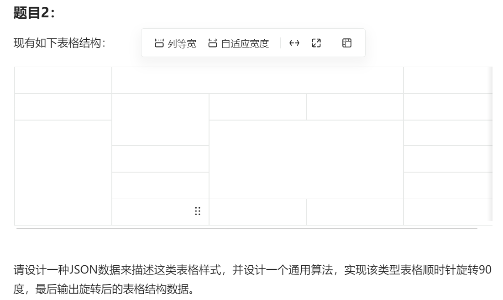
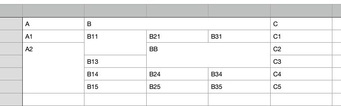
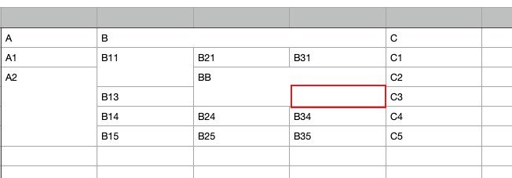

看到有一个题目，记录一下




之前没有做过这样的练习题，所以在这里记录一下作为小白的思路

一开始我是想把第一行看作标题栏

```json
{
	"A": xxx
	"B": xxx
	"C": xxx
}
```


那因为有些表格是有合并，那我就想到了也许需要取记录一下几行几列的信息

```json
{
	"A": [
		{
			row:1,
			col:1,
			val:"?"
		},
		{
			row:4,
			col:1,
			val:"?"
		}
	],

	"B": xxx
	"C": xxx
}
```

但是这个B下面那四个合并的怎么描述？

好像并不是很好的能够统一起来，


然后就想到了excel里面，我去看一下excel源文件是怎么描述这样类型的数据的



为了能够方便的看到数据，给每一个空格标上了内容

用编辑器打开乱码，想到了可以转化成别的格式，就是网上随便找了一下，还可以直接转成json格式

上面用json描述的是这样，我这里第一列没用，所以多出现了一个null

```json
[
 null,
 {
  "Column2": "A",
  "Column3": "B",
  "Column6": "C"
 },
 {
  "Column2": "A1",
  "Column3": "B11",
  "Column4": "B21",
  "Column5": "B31",
  "Column6": "C1"
 },
 {
  "Column2": "A2",
  "Column4": "BB",
  "Column6": "C2"
 },
 {
  "Column3": "B13",
  "Column6": "C3"
 },
 {
  "Column3": "B14",
  "Column4": "B24",
  "Column5": "B34",
  "Column6": "C4"
 },
 {
  "Column3": "B15",
  "Column4": "B25",
  "Column5": "B35",
  "Column6": "C5"
 }
]
```

它是描述成一个数组，然后每一个 `{}` 表示一行，所以它本身就有描述行的含义
然后是每一行中，键，字符串，本身还包括了哪一列的信息

那是它是怎么解决合并单元格的信息描述的？

默认第一次出现在最左上角的那一格，被合并了的单元格就不再出现了，

比如



这一个单元格，本来应该描述在第四行，第五列

但因为它是合并的，所以它的数据已经出现在第三行，第四列，


```json
 {
  "Column3": "B13",
  "Column6": "C3"
 },
```

那么描述第四行的就直接跳过了，键的字符串值， `Column3`和 `Column6` 本身就包含了信息
