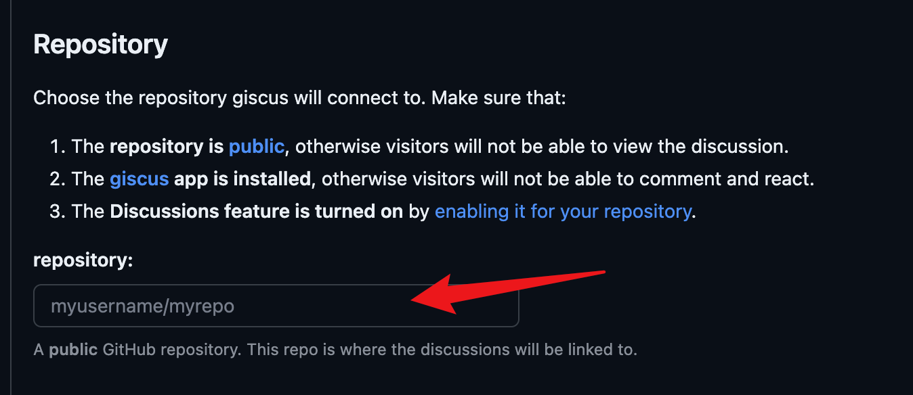
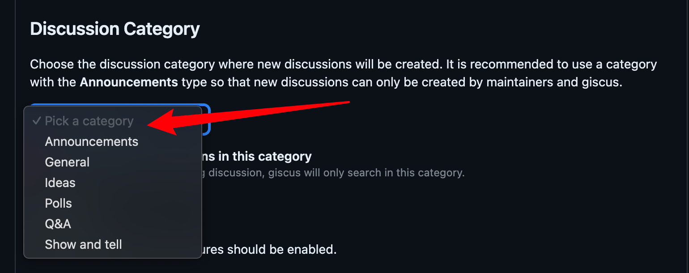

## Giscus.html

如果使用的模版里面已经整合了giscus的页面代码，只需要做一些配置，这一步可以略过

```html

<!-- https://giscus.app/ -->
<script type="text/javascript">
  (function () {
    const origin = 'https://giscus.app';
    const iframe = 'iframe.giscus-frame';
    const lightTheme = 'light';
    const darkTheme = 'dark_dimmed';

    let initTheme = lightTheme;
    const html = document.documentElement;

    if (
      (html.hasAttribute('data-mode') &&
        html.getAttribute('data-mode') === 'dark') ||
      (!html.hasAttribute('data-mode') &&
        window.matchMedia('(prefers-color-scheme: dark)').matches)
    ) {
      initTheme = darkTheme;
    }

    let giscusAttributes = {
      src: 'https://giscus.app/client.js',
      'data-repo': '{{ site.comments.giscus.repo}}',
      'data-repo-id': '{{ site.comments.giscus.repo_id }}',
      'data-category': '{{ site.comments.giscus.category }}',
      'data-category-id': '{{ site.comments.giscus.category_id }}',
      'data-mapping': '{{ site.comments.giscus.mapping | default: 'pathname' }}',
      'data-reactions-enabled': '{{ site.comments.giscus.reactions_enabled | default: '1' }}',
      'data-emit-metadata': '0',
      'data-theme': initTheme,
      'data-input-position': '{{ site.comments.giscus.input_position | default: 'bottom' }}',
      'data-lang': '{{ site.comments.giscus.lang | default: lang }}',
      'data-loading': 'lazy',
      crossorigin: 'anonymous',
      async: ''
    };

    let giscusScript = document.createElement('script');
    Object.entries(giscusAttributes).forEach(([key, value]) =>
      giscusScript.setAttribute(key, value)
    );
    document.getElementById('tail-wrapper').appendChild(giscusScript);

    addEventListener('message', (event) => {
      if (
        event.source === window &&
        event.data &&
        event.data.direction === ModeToggle.ID
      ) {
        /* global theme mode changed */
        const mode = event.data.message;
        const theme = mode === ModeToggle.DARK_MODE ? darkTheme : lightTheme;

        const message = {
          setConfig: {
            theme: theme
          }
        };

        const giscus = document.querySelector(iframe).contentWindow;
        giscus.postMessage({ giscus: message }, origin);
      }
    });
  })();
</script>


```


可以将上面的代码保存在`_includes/`文件夹下面

然后在你的`layout`中去 `include` 这个页面，具体的布局不展开了。

## giscus.app

点击 [giscus.app](https://giscus.app/)

在 Repository 这里填写你的仓库



在 Discussion Category 这里选择一个，一般Announcements就可以



然后就能在 Enable giscus 部分看到你的

- data-repo
- data-repo-id
- data-category
- data-category-id


## _config.yml

```yml
comments:
	active: giscus
	giscus:
		repo:
		repo_id:
		category:
		category_id:
		mapping: #default pathname
		input-position: # default bottom
		lang: #default site.lang
		reactions-enabled: #default 1
```

上面 `repo`,`repo_id`等就是前一步你在 giscus.app 页面上生成的


## How giscus works?

> When giscus loads, the GitHub Discussions search API is used to find the Discussion associated with the page based on a chosen mapping (URL, pathname, <title>, etc.). If a matching discussion cannot be found, the giscus bot will automatically create a discussion the first time someone leaves a comment or reaction.

> To comment, visitors must authorize the giscus app to post on their behalf using the GitHub OAuth flow. Alternatively, visitors can comment on the GitHub Discussion directly. You can moderate the comments on GitHub.
