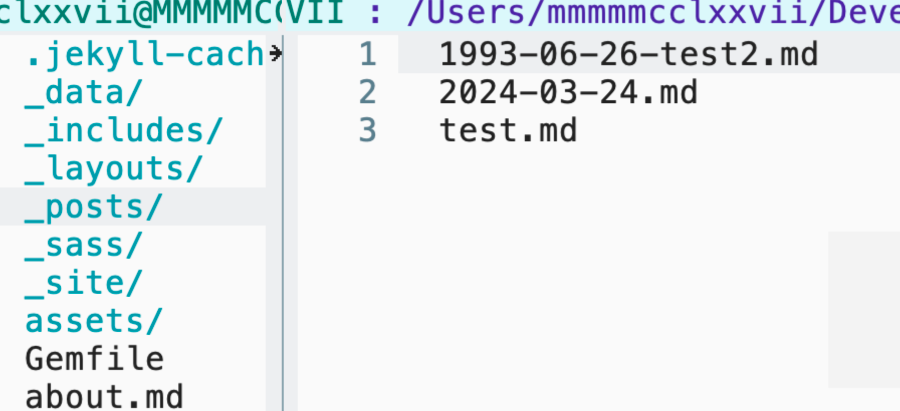
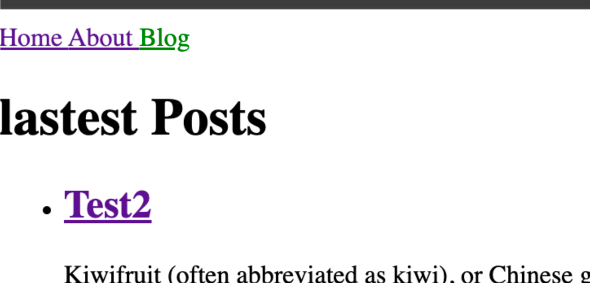

## 在Jekyll中哪一部分使用Liquid语言， 也就是在哪里编写Liquid
1. html文件，md文件，但是需要加上front matter,让jekyll知道需要特殊处理
2. 一些模版文件，比如在`_layouts`,`_includes`文件夹里面，可以不用加front matter，因为这些就是属于Jekyll内部组织结构的

## 什么是Front matter

顾名思义，front这部分很重要

在一个html文件中

```html
---
title: Home
---
<!doctype html>
<html>
...

```

```
---
title: Home
---

```
这部分就是 front matter

它是一个YAML，YAML就是一种数据序列化语言，是一个个键值对
会被Jekyll读取然后作为 Page对象的成员数据，然后就可以用Liquid语法进行访问

## front matter 中定义了 title 然后怎么用它

`{{page.title}}`

page是Jekyll给的变量

可以参考 [Variables](https://jekyllrb.com/docs/variables)

## `_layouts`文件夹有什么用

这里面装的是内容的模版

比如想增加一个页面，如果不能“提取公因数”的话，每个文件都要写一遍，类似
```html

<!doctype html>
<html>
  <head>
	<meta charset="utf-8">
	<title>{{ page.title }}</title>
  </head>
  <body>
	{{ content }}
  </body>
</html>

```

这样的东西

就会很烦
所以把上面的定义在`_layous`文件夹里面，比如写在`default.html`文件中

然后在 `xxx.html`中

```html

---
layout: default
title: Home
---
<h1>{{ "Hello World!" | downcase }}</h1>

```

这样就可以专注于内容，因为这一块会全部当作 content 插入到default layout定义的` {{content}} `中

## `_includes`文件夹是干什么用的

其实也是模版的作用，本质也是“提取公因数”

`_layouts`作用是组织层面上，内容的分离，重点是专注内容
`_includes`作用是组织层面上，代码的分离,重点是复用代码

就像`yas-snippet`似的

例如在 `_includes/navigation.html`中
```html

<nav>
  <a href="/">Home</a>
  <a href="/about.html">About</a>
</nav>

```

然后在`_layouts/default.html`

```html

<!doctype html>
<html>
  <head>
	<meta charset="utf-8">
	<title>{{ page.title }}</title>
  </head>
  <body>
	
	{{ content }}
  </body>
</html>

```
通过

```html



```

来引用这段代码

当然也可以在其他html中这么干，相当于就是复用代码了

## `_data`文件夹是干什么用的

`_include`抽象出代码片段， `_data`抽象出数据

jekyll支持 YAML,json,csv三种格式的数据定义

比如 `_data/navigation.yml`

```yml
- name: Home
  link: /
- name: About
  link: /about.html
```

这样在其他地方，可以用 `site.data.navigation` 来访问这些数据

例如`includes/navigation.html`

```html

<nav>
  
    <a href="{{ item.link }}" style="color: red;">
      {{ item.name }}
    </a>
  
</nav>

```


## Jekyll 的样式是怎么组织的

这是在`html`文件中正常写的 `<link rel="stylesheet" href="/assets/css/styles.css">`

但是`assets/css/`下的不是`styles.css` 而是`styles.scss`,

`jekyll`会通过`styles.scss`自动生成`styles.css`

因为`scss`可以扩展，加入一些新的语法特性

可以像`include`那样创建`html`代码片段

这里也有类型的`_sass/`文件夹保存`scss`样式代码

然后在`/assets/css/styles.css`中可以`@import "xxx"`;

`jekyll`会去`_sass/`找对应的`scss`文件，然后把它导进来

所以 `xxx`的名字需要对应`_sass/xxx.scss`名字


## 为什么页面上没有显示全post？




`_posts`中有3个文件，为什么只列出了一个呢？

命名规则

Jekyll中post文件的命名需要是 `日期-title.md` 这样子的


## jekyll中的 post.url,author.url是什么？

```html

<li><a href="{{ post.url }}">{{ post.title }}</a></li>

<a href="{{ author.url }}">{{ author.name }}</a>

```

代码中看到类似这样的,`post.url` 这里的属性 url 是啥？ 好像data中配置的 `navigation.yml` 属性没有url

```yml
- name: Home
  link: /
- name: About
  link: /about.html
```

就理解为这个 `xxx.url` 是Jekyll生成的 `xxx` 页面的链接


见参考 [site.url](https://jekyllrb.com/docs/variables/#:~:text=with%20tag%20TAG.-,site.url,-Contains%20the%20url)


## 怎么配置了_config.yml没有生效？

如果是在 `–-livereload` 模式下，你没看到效果的话，需要`restart`一下`jekyll server`才能看到效果


## _config.yml 中的 defaults 配置是什么？

比如
```yml
defaults:
  - scope:
      path: ""
      type: "authors"
    values:
      layout: "author"
  - scope:
      path: ""
      type: "posts"
    values:
      layout: "post"
  - scope:
      path: ""
    values:
      layout: "default"
```


这是Front matter的defaults配置

我们不是在每个页面的front matter都会写一些`layout:xxx`

每一个都要写，会有点烦，所以在这个统一配置，

而且可以用scope范围来批量设置 path是相对root路径 type是authors的话，就对应`_authors/`文件夹里面的 type是posts的话,就对应`_posts/`文件夹里面的


## gemfile.lock是干什么的

它可以 “锁住” 当前的gem版本，未来bundle install其他插件的时候 会和当前的gem版本对齐，这样避免了一些依赖错误


## Gemfile.lock怎么来的？

bundle install的时候生成的

## gemfile和_config.yml重复申明？

为什么在`gemfile` 中

```
group :jekyll_plugins do
  gem "jekyll_sitemap"
  gem "jekyll_feed"
  gem "jekyll_seo-tag"
end

```

还要在 `_config.yml`

```
plugins:
  - jekyll_sitemap
  - jekyll_feed
  - jekyll_seo-tag

```

这样声明

*如果没有Gemfile，需要手动的保证在plugins配置下的插件要提前装好在系统里*

Gemfile只是Ruby项目依赖管理，告诉gem要装哪些，用不用另说. *负责有没有*

`_config.yml`是Jekyll的项目配置文件，告诉Jekyll在构建站点的时候需要 加载 哪些插件 *负责用不用*

## type的意思

```yml
defaults:
  - scope:
      path: ""
      type: posts
    values:
      layout: post
      permalink: /posts/:title/
```

这里的 scope 里面的type是什么意思

type是collection的type

scope,这里path是 “”，意味着我们会给项目里面所有的文件都起作用 就是添加 values 中的front matter

但是我们有时候不想给所有，所以指定type

默认的有 pages,posts,drafts,

但是我们可以自己声明 collection, 这些声明也可以作为type

```
collection:
	authors:
```

那这样 authors 就是一个type， 他是` _authors/`文件夹下面的那些


## jekyll是如何将用到 `_sass/` 下面的文件的

有一个插件叫 `jekyll-sass-converter` , 不过在`Jekyll 2.0.0`之后就内置了 不需要手动安装了

它会去找 `_sass` 文件夹然后去做转化

## jekyll在safe模式下,会加载`_plugins`文件夹下面的插件吗？

不会


## 如果想要在safe模式下加载一些plugin，怎么办

在`_config.yml`中
```
whitelist:
  - jekyll-gist
  - jekyll-coffeescript
  - jekyll-seo-tag
```

## `jekyll_plugins`是什么意思

```gemfile
group :jekyll_plugins do
  gem "jekyll-cli-plus"
  gem "jekyll-seo-tag", "~> 1.5"
  gem "some-other-jekyll-plugin"
end
```

这里`jekyll_plugins`是一个分组，但是是一个特殊的分组，是会被Jekyll特殊对待的，他会在Jekyll前加载这些plugin，不管是不是safe模式


## 如何在Jekyll md文件 中插入Liquid源代码而不会被解释

```liquid


{%% raw %%}
这里的liquid代码不会被解释
{%% endraw %%}


```


## 为什么我的改动push到github上后，访问xxx.github.io没有变？

Jekyll生成的是静态页面，意味着浏览器访问一次后，会有缓存或者是CDN等技术来加载，即使部署了新的内容，可能访问的也是原来的版本
可以等一会，或者清空浏览器缓存。
反正不是大问题
