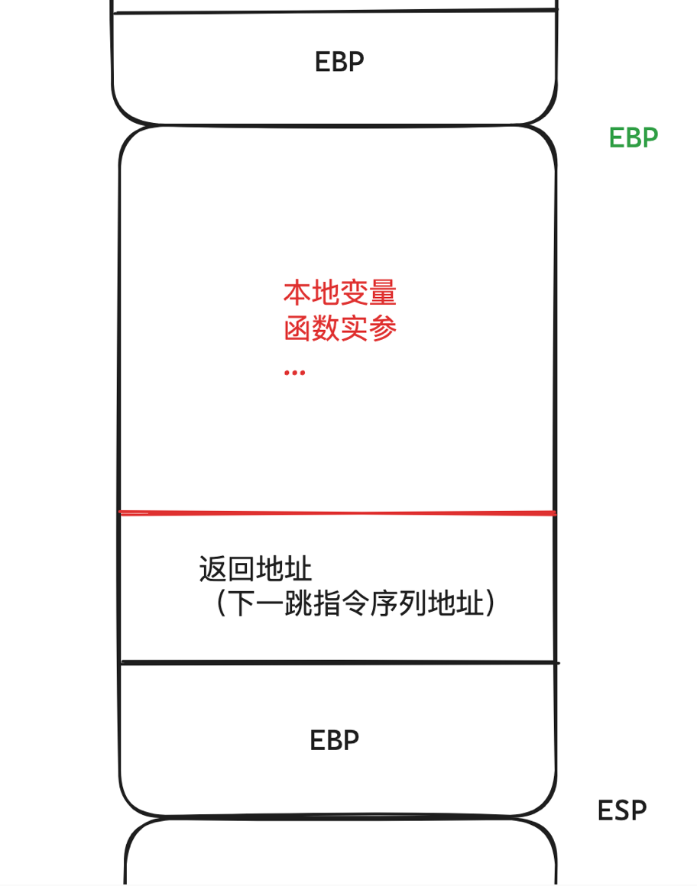
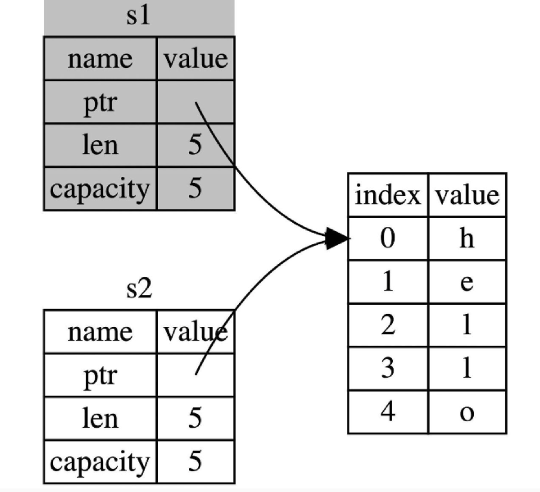
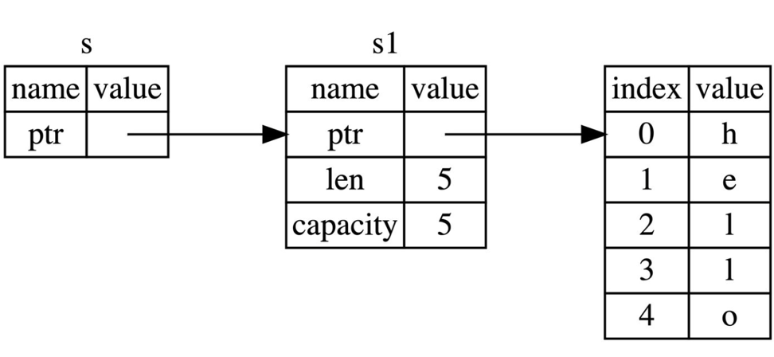

# Table of Contents

1.  [所有权是解决什么问题的？](#org1481708)
    1.  [内存安全问题](#org8556d6f)
        1.  [answer](#org9503f0d)
    2.  [之前的解决方式](#org97dab9a)
2.  [Rust是怎么解决这个问题的？](#org1cf9bef)
    1.  [什么是所有权呢？](#org5abb07c)
    2.  [所有者是什么意思？](#org7a4017c)
    3.  [释放值什么意思？它们本来在哪？](#orge61e11e)
        1.  [值存在哪里？](#org485c591)
        2.  [函数调用时栈的变化,ebp和esp的变化](#org2b1e9be)
    4.  [任意时刻只有一个所有者，那 let y = x 发生了什么？](#org36a48b7)
    5.  [哪还有那些会发生转移的](#orgf5ea0e9)
    6.  [那程序中肯定有很多值传来传去，所有权转移来转移去，还要通过返回值去把所有权接受回来，那岂不是很麻烦？](#org5895332)
    7.  [怎么用引用获取值？](#org675c298)
    8.  [那意思是只是可读？](#org064735c)
    9.  [诶？会不会有一种情况是原来的值被释放了，但是引用还在，怎么办？](#org50a7178)
    10. [所有权系统怎么保证内存安全？](#org48360e0):drill:
        1.  [我的思考](#org41ca34d)
3.  [案例分析](#orgd48212f)
    1.  [那这里程序到底发生了什么？所有权是拥有值还是拥有内存空间](#org14c9248)


# 所有权是解决什么问题的？ {#org1481708}

先不管所有权的定义是什么，

1.  先搞清楚所有权是为了解决什么问题而提出的
2.  之前是怎么解决这些问题的


## 内存安全问题      {#org8556d6f}

什么是内存安全问题？


### answer {#org9503f0d}

所有的程序都必须和计算机内存打交道，如何从内存空间申请空间存放程序的运行内容。
这是基础
那么问题来了，因为计算机的内存资源是很宝贵的，如何在申请空间不用了之后去释放掉这些空间，就是一个很重要的问题

这就是内存安全问题。因为如果没有释放掉，那些程序不用了的数据占着茅坑不拉屎，就是所谓的内存泄漏。


## 之前的解决方式 {#org97dab9a}

在计算机发展以来，主要是依赖两种方式

1.  手动，运行时。 手动管理内存的分配和释放，在程序中，通过调用函数来申请和释放内存，比如C/C++
    那么这种设计，编写程序的自由灵活度很高，程序性能好，但是正是因为如此，所以很容易造成内存泄漏，对程序员的要求很高
2.  自动，运行时。 内存回收机制 GC，程序自动的去找那些用不到的内存区域，去回收，比如Java/GO
    但是因为是垃圾回收是自动的，所以他的代价是性能问题（stop the world），内存占用（垃圾回收程序是一个程序，需要运行空间来保存一些数据）
    这种在高性能，系统级编程上是不能适合的。


# Rust是怎么解决这个问题的？ {#org1cf9bef}

> Rust is a modern system programming language focused on performance, safety, and concurrency.It accomplishes these goals without having a garbage collector

Rust的定位是系统级编程语言，但是它引入了 所有权 来解决内存安全问题


## 什么是所有权呢？ {#org5abb07c}

> Ownership is a set of rules that govern how a Rust program manages memory.

上面两种保护内存安全的方式，都是运行时，那么所有权在设计上选择了在编译时保护。
编译器在编译时会根据一系列的规则进行检查。如果违反了任何这些规则，程序都不能编译。在运行时，所有权系统的任何功能都不会减慢程序。

所以什么规则其实就是解释了所有权的概念

所有权规则

1.  Each value in Rust has an owner.
2.  There only be one owner at a time.
3.  when the owner goes out of scope, the value will be dropped.

任何时候一个值有且只有一个所有者，然后这个值随着所有者的作用域结束就释放掉了


## 所有者是什么意思？ {#org7a4017c}

这里就是涉及到 **变量绑定**
其实就是赋值，但是在Rust我们定义赋值的左式为所有者，
这么叫就是为了明确所有权概念


## 释放值什么意思？它们本来在哪？      {#orge61e11e}

when the owner goes out of scope, the value will be dropped
这里的释放是什么意思，在哪里释放，怎么释放？


### 值存在哪里？ {#org485c591}

这就涉及到栈和堆的概念了，
这两个是编程语言中最核心的数据结构

还有一个概念叫栈帧

注意，栈是数据结构，是抽象的，栈帧是一个函数被调用的时候，系统分配的一块独立的空间，是物理的，这个空间使用栈结构实现的。

这样，在一个函数里面所用到的 状态和变量 就被保存在栈帧里面

对于一个运行中的函数，其使用的栈帧区域被sp和bp寄存器限定
（对于x86，sp等价esp，bp等价rsp；对于x64，sp等价rsp，bp等价rbp）。
bp指向栈帧的底部，sp指向栈帧的顶部。

诶，但是有一个问题，就是变量的类型，分为固定大小和可变的，那么这些可变的怎么保存在栈里面？

所以为了性能（栈指针的移动就以固定大小来移动）和可变大小数据的保存，引入了堆

计算机程序的运行依赖栈和堆来推进程序的推进

栈里面的数据是已知且固定大小的，比如一些基础类型，int，float，char等
而那些不知道大小的也就是动态的，可变大小的，比如一个对象，结构体，String等，就放在堆里

在堆上放入数据，需要申请和分配，然后怎么访问呢？分配完后会给你一个地址，在程序中这个地址又叫指针
然后栈里面保存的是这个指针，保存这个指针的变量是指针类型的变量

我理解的变量，是变量名+变量地址（栈空间的地址），变量名是为了让程序员方便以人类语言去写代码的，
它会在编译后在底层执行的时候变成这个变量地址，这是给机器看的

一般来说，一个变量基本上作用域就是在这个函数里面，

诶不对啊，一个函数结束了，这个变量就没了？ 是的，除非他是全局变量，那这个变量不保存在栈帧中

那怎么感觉程序能运行这么久呢？ 是因为函数中有调用其他函数啊

这个变量可以通过 参数传递的方式，进入到另一个函数的栈帧中，而这里这个传递，就是复制值到调用函数的空间。


### 函数调用时栈的变化,ebp和esp的变化 {#org2b1e9be}

详细可看 [函数调用和栈的变化](https://luckyfuture.top/StackAndFuncCall#%E4%B8%80%E4%B8%AA%E4%BE%8B%E5%AD%90) ，ebp和esp的变化

    fn main(){
        a();
    }
    fn a(){
        let x = 5;
        let y = "hello world";
        let z = 11.3;
        b(x,y,z);
    }

    fn b(x:i32,y:&str,z:f64){
        println!("x:{x}\ny:{y}\nz:{z}");
    }


```
: x:5
: y:hello world
: z:11.3
```

首先每个函数在开始的时候会做的一件事是

1.  先将ebp入栈，此时的ebp指向的是调用者函数栈帧的基底
    目的是保存调用函数的栈状态
    在上面a函数开始的时候，会将main函数的ebp入栈
2.  然后将ebp变成esp，此时开始就是 被调用函数的栈帧空间了
    上面a函数在执行的时候，有局部变量x,y,z,就依次压栈，esp指向栈顶

在a调用b 时发生的事情

3.  从右往左，依次压栈z,y,x。此时进入的还是a函数的栈帧空间
4.  底层在执行 call指令 去实现 a调用b函数，这时候，会先将执行到a函数的下一条指令地址，PC寄存器入栈，这个就是返回地址
    此时esp和ebp 构成的区域还是a函数的栈帧空间
5.  执行b函数指令序列，同样的会先做上面保存现场的两件事
    所以一个函数的栈帧空间,在有调用发生的时候，完整的空间分布是这样子的



只是这个EBP的入栈是 被调用函数 帮忙做的

6.  开始执行b函数的指令序列

调用完成后返回时发生的事情

7.  一般这时候的指令序列是

    pop ebp

    ret

    有的时候是

	leave

	ret

	leave其实是

	mov esp,ebp

	pop ebp

	就多了一个mov esp,ebp操作

	这里这么做就是不管此时栈顶在哪，回到栈底，那之前的就当作释放了

	此时虽然esp指向的是ebp

	然后会执行 pop ebp，因为调用结束了么，此时栈顶一般就是函数一开始执行的将ebp入栈的操作的ebp

	将此时栈里面的栈顶元素赋给ebp，esp退一格

	然后执行ret

	ret其实是这两个指令

	pop eip

	jmp return_addr

	上一个栈顶元素是保存的EBP，被pop出来后，这时候的栈顶元素是call指令保存的返回地址
    然后通过jmp指令继续 调用函数的指令执行


## 任意时刻只有一个所有者，那 let y = x 发生了什么？ {#org36a48b7}

这就涉及到数据的交互，以及所有权的转移

对于基本类型
let x = 5;
let y = x;

整个过程的赋值都是通过 值拷贝 的方式在栈上完成的
这里没有发生所有权的转移
而是x是0x123中5的所有者，y是0x456中的所有者

但其实所有者更多的还是针对 堆上的数据

let s1 = String::from("hello world");
let s2 = s1;

这里 s1 的值是一个String类型，他是存储在堆上的，他不能自动拷贝

s1变量是存在栈上的，栈上的结构是

堆指针：指向堆里真实存储字符串的地址
字符串长度：目前使用的长度
字符串容量：堆内存分配空间的大小

这样组成的固定大小的类型

其他语言可能就一个指针，其他信息放在堆中，比如Java

在Java中，这里的赋值，其实就是引用的赋值，那么此时就是两个指针指向了内存中的字符串，其中一个动了，那么另一个就能感受到

    public static class Person{
        private String name;
        private int age;

        public Person(String name,int age){
            this.name = name;
            this.age = age;
        }
        public void setAge(int age){
            this.age = age;
        }
        @Override
        public String toString(){
            return "name = "+name+"\n"+"age = "+age;
        }
    }

    public static void main(String[] args){
        Person p1 = new Person("cy",29);
        Person p2 = p1;
        System.out.println(p1);
        System.out.println(p2);
        p1.setAge(30);
        System.out.println(p2);
    }


```
: name = cy
: age = 29
: name = cy
: age = 29
: name = cy
: age = 30

```

而这样在Rust中是不允许的

因为像类似Java语言中，可以有多个指针指向这块内存，这就意味着这块内存不明确什么时候可以被释放

因为如果马上随着第一个变量的作用域结束而释放的话，那么其他地方引用到这块内存的，再次访问就会出错

正因为如此，Java中才会出现垃圾回收机制到处去找哪里有没有不用了的内存

在Rust中 在let s2 = s1 语句执行后，我们说 堆里字符串的所有者从s1转移到了s2
其实具体是，两个步骤

1.  s1变量拷贝给s2后（栈空间的操作，这步很快）
2.  将s1失效

如果你在其他语言中听说过术语 浅拷贝(shallow copy) 和 深拷贝(deep copy)，那么拷贝指针、长度和容量而不拷贝数据听起来就像浅拷贝，
但是又因为 Rust 同时使第一个变量 s1 无效了，因此这个操作被称为 移动(move)，而不是浅拷贝。



s1 不再指向任何数据，只有 s2 是有效的，当 s2 离开作用域，它就会释放内存

所以称 let a = b 这样的叫做绑定


## 哪还有那些会发生转移的 {#orgf5ea0e9}

其实就要去思考，这里有没有发生 数据交互，或者说上面那样的传递

在函数调用的过程中，函数参数的传递就是一种隐藏的所有权转移

    fn main(){
        let s = String::from("Hello world");
        println!("{s}");
        test(s);
        //这里再去 打印 s 会报错
        //println!("{s}");
    }
    fn test(s:String){
        println!("{s}");
    }


```
: Hello world
: Hello world
```

如果把main方法中第二个打印语句开启的话，会得到

```rust
6 |       println!("{s}");
                   ^^^ value borrowed here after move
```


这样的一个报错

原因就在于,main方法中 s 的值已经移动到test方法中，s不再有效

同样，函数的返回值也有所有权

       fn main() {
        let s1 = gives_ownership();         // gives_ownership 将返回值
                                            // 移给 s1

        let s2 = String::from("hello");     // s2 进入作用域

        let s3 = takes_and_gives_back(s2);  // s2 被移动到
                                            // takes_and_gives_back 中,
                                            // 它也将返回值移给 s3
    } // 这里, s3 移出作用域并被丢弃。s2 也移出作用域，但已被移走，
      // 所以什么也不会发生。s1 移出作用域并被丢弃

    fn gives_ownership() -> String {             // gives_ownership 将返回值移动给
                                                 // 调用它的函数

        let some_string = String::from("hello"); // some_string 进入作用域.

        some_string                              // 返回 some_string 并移出给调用的函数
    }

    // takes_and_gives_back 将传入字符串并返回该值
    fn takes_and_gives_back(a_string: String) -> String { // a_string 进入作用域

        a_string  // 返回 a_string 并移出给调用的函数
    }


## 那程序中肯定有很多值传来传去，所有权转移来转移去，还要通过返回值去把所有权接受回来，那岂不是很麻烦？ {#org5895332}

对，如果仅仅支持通过转移所有权的方式获取一个值，那会让程序变得复杂
所以Rust中引入了 引用 来解决这个问题

引用的语法其实和C++中的是一致的
利用引用产生的行为，在Rust中称作借用，顾名思义，其不拥有对值的所有权

    fn main(){
        let s = String::from("hello world");
        println!("{s}");
        test(&s);
        println!("{s}");
    }

    fn test(s:&String){
        println!("inside test:{s}");
    }

```
: hello world
: inside test:hello world
: hello world
```

这里test方法中，s没有拥有 堆中字符串的所有权。


## 怎么用引用获取值？ {#org675c298}

上面还有一点就是引用类型，要想使用值就要解引用

同样类似C/C++中的指针操作

      fn main() {
        let x = 5;
        let y = &x;

        assert_eq!(5, x);
        assert_eq!(5, *y);
    }

\*y 就是解引用


## 那意思是只是可读？ {#org064735c}

有点像并发编程，一个拥有读写，一个只能读？

完全不是一个概念，主要是所有权的归属，就决定了这个值在哪个作用域结束后释放

这里涉及到 可变引用和不可变引用的概念

不可变引用
```rust
      fn main() {
        let s1 = String::from("hello");

        let len = calculate_length(&s1);

        println!("The length of '{}' is {}.", s1, len);
    }

    fn calculate_length(s: &String) -> usize {
        s.len()
    }
```
上面就是将 s1 的引用作为参数传递给方法 calculate_length ,而不是所有权转移给这个方法

1.  无需像之前：先通过函数参数传入所有权，然后再通过函数返回来传出所有权，代码更加简洁
2.  calculate_length 的参数 s 类型从 String 变为 &String

& 符号即是引用，它们允许你使用值，但是不获取所有权



通过 &s1 语法，我们创建了一个指向 s1 的引用，但是并不拥有它。

**因为并不拥有这个值，当引用离开作用域后，其指向的值也不会被丢弃。**

但是这时候去改变值是不行的

    fn main(){
        let s = String::from("hello");
        change_s(&s);
        println!("{s}");
    }
    fn change_s(s:&String){
        s.push_str(" world");
    }

上面程序会报错，


```rust
error[E0596]: cannot borrow `*some_string` as mutable, as it is behind a `&` reference
 --> src/main.rs:8:5
  |
7 | fn change(some_string: &String) {
  |                        ------- help: consider changing this to be a mutable reference: `&mut String`
                           ------- 帮助：考虑将该参数类型修改为可变的引用: `&mut String`
8 |     some_string.push_str(", world");
  |     ^^^^^^^^^^^ `some_string` is a `&` reference, so the data it refers to cannot be borrowed as mutable
                     `some_string`是一个`&`类型的引用，因此它指向的数据无法进行修改

```


这一方面是因为 本身 main 中的 s 就是不可变的，另外 引用也是不可变引用

所以要达到通过引用改变值，Rust 引入了一个可变引用

      fn main() {
        let mut s = String::from("hello");
        let s1 = &mut s;
        change(s1);
        println!("{s}");
    }

    fn change(some_string: &mut String) {
        some_string.push_str(", world");
    }

```
: hello, world
```

**声明 s 是可变类型，其次创建一个可变的引用 &mut s 和接受可变引用参数 some_string: &mut String 的函数**

注意

`let s1 = &mut s` 是这样写，而不是 `let &mut s1 = s` 或者 `let &mut s1 = &s`

s1 的类型是 &mut String

对于可变引用，因为涉及到更改，所以对他还有一些规则限制

1.  可变引用在同一作用域只能存在一个

        let mut s = String::from("hello");
        let r1 = &mut s;
        let r2 = &mut s;

        println!("{}, {}", r1, r2);

    这样就不行，第一个可变借用 r1 必须要持续到最后一次使用的位置 println!，在 r1 创建和最后一次使用之间，我们又尝试创建第二个可变借用 r2。

    其实这里在做的事情是避免数据竞争。
    数据竞争会导致未定义行为，这种行为很可能超出我们的预期，难以在运行时追踪，并且难以诊断和修复。
    而 Rust 避免了这种情况的发生，因为它甚至不会编译存在数据竞争的代码！

2.  可变引用和不可变引用不能同时存在

        let mut s = String::from("hello");

        let r1 = &s; // 没问题
        let r2 = &s; // 没问题
        let r3 = &mut s; // 大问题

        println!("{}, {}, and {}", r1, r2, r3);

    其实这个也很好理解，正在借用不可变引用的用户，肯定不希望他借用的东西，被另外一个人莫名其妙改变了。
    多个不可变借用被允许是因为没有人会去试图修改数据，每个人都只读这一份数据而不做修改，因此不用担心数据被污染。

关于引用，还有一个重要的一个点，就是引用的作用域

**引用的作用域 s 从创建开始，一直持续到它最后一次使用的地方，这个跟变量的作用域有所不同，变量的作用域从创建持续到某一个花括号 }**

      fn main() {
       let mut s = String::from("hello");

        let r1 = &s;
        let r2 = &s;
        println!("{} and {}", r1, r2);
        // 新编译器中，r1,r2作用域在这里结束

        let r3 = &mut s;
        println!("{}", r3);
    } // 老编译器中，r1、r2、r3作用域在这里结束
      // 新编译器中，r3作用域在这里结束

在老版本的编译器中（Rust 1.31 前），将会报错，因为 r1 和 r2 的作用域在花括号 } 处结束，那么 r3 的借用就会触发 无法同时借用可变和不可变的规则。

但是在新的编译器中，该代码将顺利通过，因为 引用作用域的结束位置从花括号变成最后一次使用的位置，因此 r1 借用和 r2 借用在 println! 后，就结束了，此时 r3 可以顺利借用到可变引用。

对于这种编译器优化行为，Rust 专门起了一个名字 —— Non-Lexical Lifetimes(NLL)，专门用于找到某个引用在作用域(})结束前就不再被使用的代码位置。


## 诶？会不会有一种情况是原来的值被释放了，但是引用还在，怎么办？ {#org50a7178}

其实这种现象叫 悬垂引用 Dangling References 也叫悬垂指针

我感觉在单线程中，因为是顺序执行，和函数栈帧保证, 因为只是传递引用，所以可以保证调用方始终有所有权，而他也是决定所有权作用域的一方，那就没事

除非是有一种方式,就是 利用函数返回值，返回一个引用,来制造一个悬垂指针

    fn main(){
        let dangeling_references = dangle();
    }
    fn dangle()->&String{
        let s = String::from("hello");
        &s
    }

上面执行会报错
```rust
error[E0106]: missing lifetime specifier
 --> src/main.rs:5:16
  |
5 | fn dangle() -> &String {
  |                ^ expected named lifetime parameter
  |
  = help: this function's return type contains a borrowed value, but there is no value for it to be borrowed from
help: consider using the `'static` lifetime
  |
5 | fn dangle() -> &'static String {
  |                ~~~~~~~~

```

主要是这句
this function's return type contains a borrowed value, but there is no value for it to be borrowed from.
该函数返回了一个借用的值，但是已经找不到它所借用值的来源

1.  同一时刻，你只能拥有要么一个可变引用, 要么任意多个不可变引用
2.  引用必须总是有效的


## 所有权系统怎么保证内存安全？     :drill: {#org48360e0}

没用了立马丢掉

怎么才算没用了

变量所在的scope结束，生命周期结束了就没用了

除非所有权转移走，不然没有所有者了就是没用了


### 我的思考 {#org41ca34d}

内存不安全的原因是因为在程序运行的时候堆里的数据对象存在多个引用，所以不能决定什么时候要回收掉它

那么只要任何时候只存在一个引用，那么随着要用到它的变量结束了，那么堆里的数据对象自然就可以跟着回收掉。


# 案例分析 {#orgd48212f}

      fn main(){
        let mut s  = String::from("hello");
        println!("The memory address of s is: {:p}", &s as *const String);
        s = String::from("world");
        println!("The momory address os s is: {:p}", &s as *const String);
    }

```
: The memory address of s is: 0x7ff7b2ecc8b0
: The momory address os s is: 0x7ff7b2ecc8b0
```

First, I'm just curious about how Rust deal with the old value String "hello"
Because the doc says

Each value in Rust has an owner.
So I assume what happened here is new memory is allocated on the heap and given the value "world".
Then s own the value "world" which results in the dropping of "hello"

But it seems there is no move happen.
as a result, it's more like replacing, the String "world" replace the "hello". They have the save memory


## 那这里程序到底发生了什么？所有权是拥有值还是拥有内存空间 {#org14c9248}

上面的程序，我想的是打印 s变量对应的堆内存里面真正保存字符串的地址

但其实这里打印的是栈中的地址

    fn main(){
        let mut s  = String::from("hello");
        println!("The memory address of s is: {:p}", &s as *const String);
        println!("The memory address of *s is: {:p}", &*s as *const str);
        s = String::from("world");
        println!("The memory address of s is: {:p}", &s as *const String);
        println!("The memory address of *s is: {:p}", &*s as *const str);
    }

或者

      fn main(){
        let mut s  = String::from("hello");
        println!("The memory address of s is: {:?}", s.as_ptr());
        s = String::from("world");
        println!("The momory address os s is: {:?}", s.as_ptr());
    }

然后用as_str 也行

      fn main(){
        let mut s  = String::from("hello");
        println!("The memory address of s is: {:p}", s.as_str());
        s = String::from("world");
        println!("The momory address os s is: {:p}", s.as_str());
    }

因为这里我们用的是 {:p} 格式化输出 &T的地址 包括&str
，然后 s.as_str()的到的是 &str，也就是“hello”

这样可以看到地址是不一样的

回到上面程序

In general ownership has two aspects:

1.  The right to move the value anywhere in memory, and
2.  The responsibility to drop the value when it is no longer available.

For a type like String, there are two chunks of memory to consider:

-   The string value itself, which is a (pointer, length) pair.
    **this is stored on the stack** in a fixed location;
    this is the location that you're printing
-   **The heap buffer where the actual characters are stored**,
    which you can get the address of via String::as_str()

**The line s = String::from("world") first drops the original string value,**
**which deallocates the heap buffer containing "hello".**
**It then stores a pointer, etc. to a new heap buffer that contains "world"**
**into the same stack location the old pointer was stored in.**

At the end of main, the contents of the s variable are dropped just before the stack frame goes away,
deallocating the buffer containing "world".
