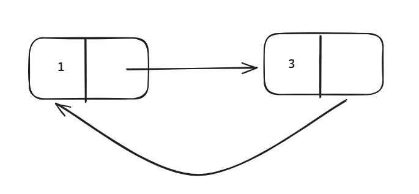
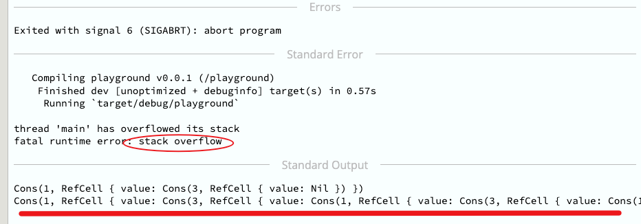

## reference cycle
rustlings到了 `Rc<T>` 这块, 就看了一下官方资料

看到

>  This function is named strong_count rather than count because the Rc<T> type also has a weak_count; we’ll see what weak_count is used for in the “Preventing Reference Cycles: Turning an Rc<T> into a Weak<T>” section.

这里的时候，就像现在学到的，怎么去创建出一个引用循环？

要做的事就很简单，图一画，心想放马过来



但实际写了代码，感觉，把马牵走


首先这里定义

```rust
use std::rc::Rc;

enum List{
	Cons(i32,Rc<List>),
	Nil,
}

use List::{Cons,Nil};

```

我本想着先定义出一个a,然后再定义另外一个b,这时候b就链接到a，然后再让a链接到b

```rust
    let a = Rc::new(Cons(3,Rc::new(Nil)));
    let b = Rc::new(Cons(1,Rc::clone(&a)));
    println!("{:?}",(*b).0);
```

关键就是怎么让 a 链接到 b？？？

`(*a).1 = b` 这样好像不行

这个是元组的访问语法，而 `List`是 enum 枚举

## 怎么修改 enum 的关联值？

比如
```rust
enum Message {
    Quit,
    Move { x: i32, y: i32 },
    Write(String),
    ChangeColor(i32, i32, i32),
}

fn main() {
    let m1 = Message::Quit;
    let m2 = Message::Move{x:1,y:1};
    let m3 = Message::ChangeColor(255,255,0);
}

```

怎么修改 `m2` 从 `Message::Move{x:1,y:1}`到 比如 `Message::Move{x:100,y:200}`

这里只能通过 pattern match 才能接触到 enum 数据

```rust

#[derive(Debug)]
enum Message {
    Quit,
    Move { x: i32, y: i32 },
    Write(String),
    ChangeColor(i32, i32, i32),
}

let mut m2 = Message::Move{x:1,y:1};

match &mut m2 {
    Message::Move { x, y } => {
        *x = 100;
        *y = 200;
    }
    _ => unreachable!(),
}

m2

```


## 再放马过来


```rust
#[derive(Debug)]
enum List{
    Cons(i32,Rc<List>),
    Nil,
}

use List::{Cons,Nil};
use std::rc::Rc;

fn main(){
    let mut a = Rc::new(Cons(3,Rc::new(Nil)));
    let b = Rc::new(Cons(1,Rc::clone(&a)));
    println!("{:?}",(*b));

    if let Cons(_val,refer) = &mut *a{
        *refer = Rc::clone(&b);
    }

    println!("{:?}",*b);
}
```


好吧，这里还是不对，

```rust
error[E0596]: cannot borrow data in an `Rc` as mutable
  --> src/main.rs:16:31
   |
16 |     if let Cons(_val,refer) = &mut *a{
   |                               ^^^^^^^ cannot borrow as mutable
```

> You aren't allowed to modify things that are directly inside an Rc. But you can put a RefCell inside an Rc.


## RefCell<T>

如果一个值的类型是`RefCell<T>`，那么他能调用两个函数，`borrow`,`borrow_mut`,对应可以得到`&`,`& mut`类型

与编译器检查不同，它是在运行时去检查 borrowing rules。什么意思呢？

就是每调用一次 `borrow` 他就会计一下，不可变引用+1，

如果调用了 `borrow_mut`，他会检查现在不可变引用计数有没有，如果有，因为Rust的借用规则，会报错，此时会panic

而这一过程是在运行时通过代码逻辑去检查的，所以是运行时检查。同时也会损失一点性能，比较要有额外的检查开销

但是他能够方便的提供一些修改的便利性

这种能力也被叫做 `interior mutability`

### official demo

```rust
#[derive(Debug)]
enum List {
    Cons(Rc<RefCell<i32>>, Rc<List>),
    Nil,
}

use crate::List::{Cons, Nil};
use std::cell::RefCell;
use std::rc::Rc;

fn main() {
    let value = Rc::new(RefCell::new(5));

    let a = Rc::new(Cons(Rc::clone(&value), Rc::new(Nil)));

    let b = Cons(Rc::new(RefCell::new(3)), Rc::clone(&a));
    let c = Cons(Rc::new(RefCell::new(4)), Rc::clone(&a));

    *value.borrow_mut() += 10;

    println!("a after = {:?}", a);
    println!("b after = {:?}", b);
    println!("c after = {:?}", c);
}
```

> By using RefCell<T>, we have an outwardly immutable List value. But we can use the methods on RefCell<T> that provide access to its interior mutability so we can modify our data when we need to

怎么理解这里的对外是不可变，但是对内可以使用 `interior mutability` 去修改值

如果是这么定义的
```rust
enum List{
	Cons(RefCell<i32>,Rc<List>),
	Nil,
}
```

那这么说可能有点问题，因为可以通过 模式匹配得到 `RefCell<i32>` 然后他可以得到可变引用，然后就可以修改了，这样外部也是可变的


但现在是这么定义的

```rust
enum List{
	Cons(Rc<RefCell<i32>>,Rc<List>),
	Nil,
}
```


加了一个 `Rc<...>`， 而`Rc<T>` only gives immutable access to that data.

但其实这里也可以通过 b 模式匹配 得到 a，然后 在模式匹配 调用borrow_mut 去改变值


```rust
#[derive(Debug)]
enum List {
    Cons(Rc<RefCell<i32>>, Rc<List>),
    Nil,
}

use crate::List::{Cons, Nil};
use std::cell::RefCell;
use std::rc::Rc;

fn main() {
    let value = Rc::new(RefCell::new(5));

    let a = Rc::new(Cons(Rc::clone(&value), Rc::new(Nil)));

    let b = Cons(Rc::new(RefCell::new(3)), Rc::clone(&a));
    let c = Cons(Rc::new(RefCell::new(4)), Rc::clone(&a));

    //*value.borrow_mut() += 10;

    println!("a  = {:?}", a);
    println!("b  = {:?}", b);
    println!("c  = {:?}", c);


    if let Cons(ref x,ref y) = b{ // y - &Rc<List>
        if let Cons(ref x1,ref y1) = **y{
            *x1.borrow_mut() += 10;
        }
    }

    println!("a after = {:?}", a);
    println!("b after = {:?}", b);
    println!("c after = {:?}", c);

}

```


## 利用 interior mutability 去搞掂我们的reference cycle


```rust
#[derive(Debug)]
enum List{
    Cons(i32,RefCell<Rc<List>>),
    Nil,
}

use List::{Cons,Nil};
use std::rc::Rc;
use std::cell::RefCell;

fn main(){
    let a = Rc::new(Cons(3,RefCell::new(Rc::new(Nil))));
    let b = Rc::new(Cons(1,RefCell::new(Rc::clone(&a))));
    println!("{:?}",(*b));

    if let Cons(ref _val, ref refer) =  *a{
        *refer.borrow_mut() = Rc::clone(&b);
    }

    println!("{:?}",*b);
}
```





太好了，看到了破坏效果，很满意
