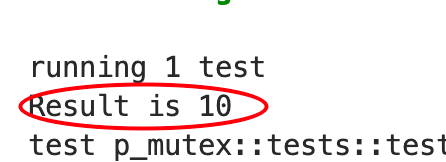

在看 [Shared-State Concurrency](https://doc.rust-lang.org/book/ch16-03-shared-state.html)

在Sharing a `Mutex<T>` Between Multiple Threads 这一章节中

我们要让10个线程各自对一个值做加1操作，

因为涉及到并发，这里用了 `Mutex` 来保护值以及管理并发

```rust
use std::sync::Mutex;
use std::thread;

fn main() {
    let counter = Mutex::new(0);
    let mut handles = vec![];

    for _ in 0..10 {
        let handle = thread::spawn(move || {
            let mut num = counter.lock().unwrap();

            *num += 1;
        });
        handles.push(handle);
    }

    for handle in handles {
        handle.join().unwrap();
    }

    println!("Result: {}", *counter.lock().unwrap());
}
```

然而这个程序是有问题的，是因为 `counter` 这个所有权在 `thread::spawn(move||{})` 中转移进去了，而这里还有一个for循环，那么第一个用了这个 counter 后，后面就用不了了

那不move的话，这个spawn thread 用的就是reference，这就设计到一个本体还存不存在的问题，因为其他线程可以作恶，让本体嗝屁，然后reference自然就无法用了，所以Rust会阻止这样的行为

那么就想到 Multiple Ownership, `Rc<T>`

用`Rc`去 wrap 一下 `Mutex`，这样可以解决往多个线程里面转移有所有权的变量

```rust
use std::rc::Rc;
use std::thread;
use std::sync::Mutex;

fn main(){
	let counter = Rc::new(Mutex::new(0));
	let mut handles = vec![]; //join()用
	for _ in 0..10{
		let counter = Rc::clone(&counter); //variable shadowing
		thread::spawn(move ||{
			let mut num = counter.lock().unwrap();
			*num += 1;
		});

		handles.push(handle);
	}

	for handle in handles{
		handle.join().unwrap();
	}

	println!("Result:{}", *counter.lock().unwrap());

}
```

理想很美好，但是Rust不让你有理想

```

$ cargo run
   Compiling shared-state v0.1.0 (file:///projects/shared-state)
error[E0277]: `Rc<Mutex<i32>>` cannot be sent between threads safely
  --> src/main.rs:11:36
   |
11 |           let handle = thread::spawn(move || {
   |                        ------------- ^------
   |                        |             |
   |  ______________________|_____________within this `[closure@src/main.rs:11:36: 11:43]`
   | |                      |
   | |                      required by a bound introduced by this call
12 | |             let mut num = counter.lock().unwrap();
13 | |
14 | |             *num += 1;
15 | |         });
   | |_________^ `Rc<Mutex<i32>>` cannot be sent between threads safely
   |
   = help: within `[closure@src/main.rs:11:36: 11:43]`, the trait `Send` is not implemented for `Rc<Mutex<i32>>`
note: required because it's used within this closure
  --> src/main.rs:11:36
   |
11 |         let handle = thread::spawn(move || {
   |                                    ^^^^^^^
note: required by a bound in `spawn`
  --> /rustc/d5a82bbd26e1ad8b7401f6a718a9c57c96905483/library/std/src/thread/mod.rs:704:8
   |
   = note: required by this bound in `spawn`

For more information about this error, try `rustc --explain E0277`.
error: could not compile `shared-state` due to previous error
```


连报错信息都这么让人崩溃

重点就是

> `Rc<Mutex<i32>>` cannot be sent between threads safely

所以Rust阻止你继续为所欲为

这是因为 `Rc<T>` 对于 内部 reference count 的管理，clone的时候加1，clone被drop的时候减1，而这些加1，减1 操作他不是原子操作

这就熟悉了，这就好比我们上面的程序，有10个线程，对 `val=0` 做加1操作，如果不做并发管理，
那么这个结果，我们想要的是`val=10`，但是有可能`val=1`

对于`Rc<T>`也一样

**而这样导致的结果是 `Rc<T>` 没有正确计数，从而造成 内存泄漏**

那你说，遇到内存不安全的问题，Rust会答应吗？它就是干这个的

不过Rust有另一个 `Arc<T>` 类型，A 就是 atomic 的意思，API都是一样的

```rust
use std::sync::{Arc, Mutex};
use std::thread;

fn main() {
    let counter = Arc::new(Mutex::new(0));
    let mut handles = vec![];

    for _ in 0..10 {
        let counter = Arc::clone(&counter);
        let handle = thread::spawn(move || {
            let mut num = counter.lock().unwrap();

            *num += 1;
        });
        handles.push(handle);
    }

    for handle in handles {
        handle.join().unwrap();
    }

    println!("Result: {}", *counter.lock().unwrap());
}
```



没有问题了
