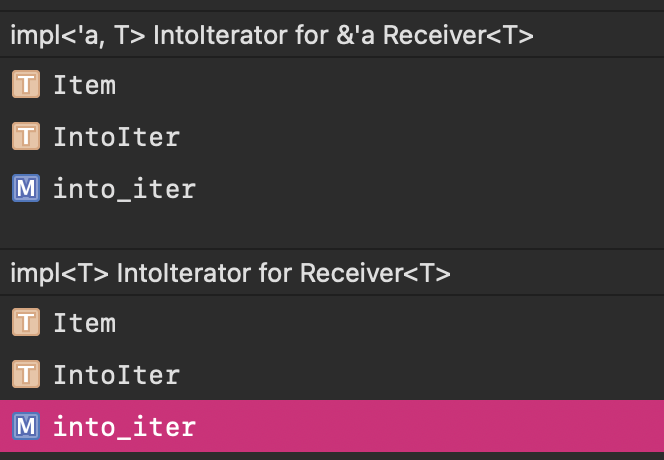
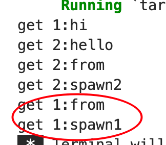
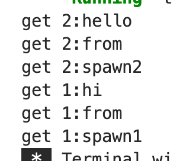

这是一段 从多个producer 发送多个消息的代码

```rust
use std::sync::mpsc;
use std::thread;
use std::time::Duration;


pub fn test_thread(){
    let (tx,rx) =  mpsc::channel();
    let tx1 = tx.clone();

    thread::spawn(move ||{
        let val = vec![
            String::from("1:hi"),
            String::from("1:from"),
            String::from("1:spawn1"),
        ];
        for v in val{
            tx1.send(v).unwrap();
        }
    });
    thread::spawn(move ||{
        let val = vec![
            String::from("2:hello"),
            String::from("2:from"),
            String::from("2:spawn2"),
        ];
        for v in val{
            tx.send(v).unwrap();
        }

    });

    for receiver in rx{
        println!("get {}",receiver);
    }
}
```


## 为啥可以 for receiver in rx

在这段代码里面，为啥可以
```rust
for receiver in rx{
}
```
这样去做

因为一般不都是 `let receiver = rx.recv().unwrap();`

因为 `for in` 其实背后的原理是迭代器

> The for in construct is able to interact with an Iterator in several ways. As discussed in the section on the Iterator trait, by default the for loop will apply the into_iter function to the collection.

所以只要看一个结构体有没有`into_iter` 函数就可以了

而这个`into_iter` 是 定义在 `std::iter::IntoIterator`  特性中方法

```rust
pub trait IntoIterator {
    type Item;
    type IntoIter: Iterator<Item = Self::Item>;

    // Required method
    fn into_iter(self) -> Self::IntoIter;
}
```

作用是将自身转化成一个 迭代器，这个是可以自定义的行为，需要返回的类型是 `Iterator<T>`

而一般的做法可以是

```rust
impl<I: Iterator> IntoIterator for I {
    type Item = I::Item;
    type IntoIter = I;

    #[inline]
    fn into_iter(self) -> I {
        self
    }
}
```

然后这时候需要自身实现 `std::iter::Iterator` 特性

主要是实现 `fn next(&mut self) -> Option<Self::Item>;` 这个方法

这样就知道迭代的下一个元素是什么了

那其实 上面的 `rx` 是一个 `std::sync::mpsc::Receiver` 结构体类型

而它实现了 `IntoIterator` 特性



```rust
#[stable(feature = "receiver_into_iter", since = "1.1.0")]
impl<T> IntoIterator for Receiver<T> {
    type Item = T;
    type IntoIter = IntoIter<T>;

    fn into_iter(self) -> IntoIter<T> {
        IntoIter { rx: self }
    }
}
```

只不过这里它内部自定义了了一个`IntoIter` 结构体，

```rust
#[stable(feature = "receiver_into_iter", since = "1.1.0")]
#[derive(Debug)]
pub struct IntoIter<T> {
    rx: Receiver<T>,
}
```

不应该是迭代器吗？ `type IntoIter: Iterator<Item = Self::Item>;` 因为`std::iter::IntoIterator`这里有一个类型约束

所以他这里自定义的 `IntoIter` 实现了 `Iterator` 特性

```rust
#[stable(feature = "receiver_into_iter", since = "1.1.0")]
impl<T> Iterator for IntoIter<T> {
    type Item = T;
    fn next(&mut self) -> Option<T> {
        self.rx.recv().ok()
    }
}
```

自此实现了闭环

可以看到在这个地方调用了 `self.rx.recv().ok()`


## 那这个for循环什么时候结束？？

这个问题我问了一下chatgpt

> 循环在何时结束取决于发送者和接收者的行为：
>
> 当发送者发送完所有消息后，并关闭通道 (tx 在循环结束后被丢弃)，接收者 (rx) 将会接收到所有消息，循环将随之结束。
> 如果发送者提前关闭了通道，或者发送者 panic，接收者将收到一个特殊的信号，表明通道已经关闭，循环也会随之结束。

大概的意思就是发送者 `tx` `tx1`啥时候scope结束后，那么此时接受者就会知道

因为本来 tx,rx 合起来才是一个整体

> A channel has two halves: a transmitter and a receiver.

体会一下这里halves的意思

测试一下
### 让`tx1`发送间隔久一点，`tx`完成早一点

```rust
use std::sync::mpsc;
use std::thread;
use std::time::Duration;


pub fn test_thread(){
    let (tx,rx) =  mpsc::channel();
    let tx1 = tx.clone();

    thread::spawn(move ||{
        let val = vec![
            String::from("1:hi"),
            String::from("1:from"),
            String::from("1:spawn1"),
        ];
        for v in val{
            tx1.send(v).unwrap();
            thread::sleep(Duration::from_secs(2));//加了这句
        }
    });
    thread::spawn(move ||{
        let val = vec![
            String::from("2:hello"),
            String::from("2:from"),
            String::from("2:spawn2"),
        ];
        for v in val{
            tx.send(v).unwrap();
        }

    });

    for receiver in rx{
        println!("get {}",receiver);
    }
}
```

在第一个spawn thread中的for循环发送中增加了 `thread::sleep(Duration::from_secs(2))`

为的是能让第二个 spawn thread早点结束，那这时候看rx会不会提早退出



不会，后面两个各等了2秒打印出来

### 让其中一个先发送完，另一个再开始发送

```rust
use std::sync::mpsc;
use std::thread;
use std::time::Duration;


pub fn test_thread(){
    let (tx,rx) =  mpsc::channel();
    let tx1 = tx.clone();

    thread::spawn(move ||{
        let val = vec![
            String::from("1:hi"),
            String::from("1:from"),
            String::from("1:spawn1"),
        ];
        thread::sleep(Duration::from_secs(5));//移到这里
        for v in val{
            tx1.send(v).unwrap();
            //thread::sleep(Duration::from_secs(2));//注释掉
        }
    });
    thread::spawn(move ||{
        let val = vec![
            String::from("2:hello"),
            String::from("2:from"),
            String::from("2:spawn2"),
        ];
        for v in val{
            tx.send(v).unwrap();
        }

    });

    for receiver in rx{
        println!("get {}",receiver);
    }
}
```

在第一个 spawn thread 开始for循环发送前，进行休眠，感觉5秒足够了

为的就是让第二个 spawn thread 早点完成，看看rx会不会结束



也不会

我猜测这里可以是 `tx.clone()` 这里起作用，rx从一开始就知道有两个发送者，只有所有的发送者都 嗝屁了，它才安心的走
