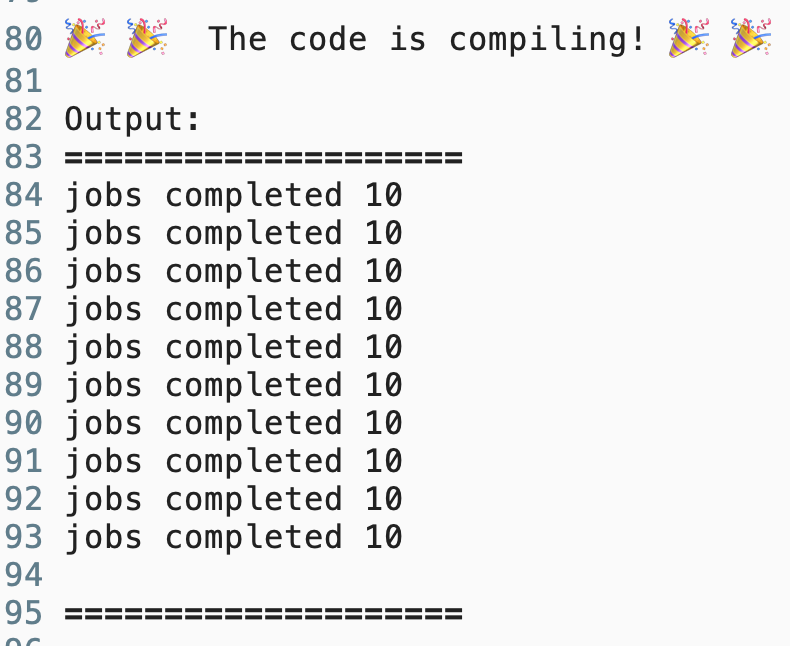

## threads1

题目是

```rust
// threads1.rs
//
// This program spawns multiple threads that each run for at least 250ms, and
// each thread returns how much time they took to complete. The program should
// wait until all the spawned threads have finished and should collect their
// return values into a vector.
//
// Execute `rustlings hint threads1` or use the `hint` watch subcommand for a
// hint.

// I AM NOT DONE

use std::thread;
use std::time::{Duration, Instant};

fn main() {
    let mut handles = vec![];
    for i in 0..10 {
        handles.push(thread::spawn(move || {
            let start = Instant::now();
            thread::sleep(Duration::from_millis(250));
            println!("thread {} is complete", i);
            start.elapsed().as_millis()
        }));
    }

    let mut results: Vec<u128> = vec![];
    for handle in handles {
        // TODO: a struct is returned from thread::spawn, can you use it?
    }

    if results.len() != 10 {
        panic!("Oh no! All the spawned threads did not finish!");
    }

    println!();
    for (i, result) in results.into_iter().enumerate() {
        println!("thread {} took {}ms", i, result);
    }
}
```

涉及的知识点就是 [join](https://doc.rust-lang.org/1.78.0/std/thread/struct.JoinHandle.html#method.join:~:text=pub%20fn%20join(self)%20%2D%3E%20Result%3CT%3E)

```rust
    for handle in handles {
        // TODO: a struct is returned from thread::spawn, can you use it?
		handle.join().unwrap();
    }
```


## threads2

题目是

```rust
// threads2.rs
//
// Building on the last exercise, we want all of the threads to complete their
// work but this time the spawned threads need to be in charge of updating a
// shared value: JobStatus.jobs_completed
//
// Execute `rustlings hint threads2` or use the `hint` watch subcommand for a
// hint.

// I AM NOT DONE

use std::sync::Arc;
use std::thread;
use std::time::Duration;

struct JobStatus {
    jobs_completed: u32,
}

fn main() {
    // TODO: `Arc` isn't enough if you want a **mutable** shared state
    let status = Arc::new(JobStatus { jobs_completed: 0 });

    let mut handles = vec![];
    for _ in 0..10 {
        let status_shared = Arc::clone(&status);
        let handle = thread::spawn(move || {
            thread::sleep(Duration::from_millis(250));
            // TODO: You must take an action before you update a shared value
            status_shared.jobs_completed += 1;
        });
        handles.push(handle);
    }

    // Waiting for all jobs to complete
    for handle in handles {
        handle.join().unwrap();
    }

    // TODO: Print the value of `JobStatus.jobs_completed`
    println!("Jobs completed: {}", ???);
}

```
这里主要是多个线程对于 同一个共享变量的操作

那题目中的代码 `Arc` 和 `Rc` 一样，在有多个所有者的情况下，是不允许改变值的，所以他也就没有实现`DerefMut`

所以需要借助 interior mutability 的能力去修改值


### 利用Mutex

```rust
use std::sync::{
    atomic::{AtomicU32, Ordering},
    Arc, Mutex,
};
use std::thread;
use std::time::Duration;
struct JobStatus {
    jobs_completed: u32,
}

fn main() {
    let status = Arc::new(Mutex::new(JobStatus { jobs_completed: 0 }));
    let mut handles = vec![];
    for _ in 0..10 {
        let status_shared = Arc::clone(&status);
        let handle = thread::spawn(move || {
            thread::sleep(Duration::from_millis(250));
            // TODO: You must take an action before you update a shared value
            let mut data = status_shared.lock().unwrap();
            data.jobs_completed += 1;
        });
        handles.push(handle);
    }
    for handle in handles {
        handle.join().unwrap();
        // TODO: Print the value of the JobStatus.jobs_completed. Did you notice
        // anything interesting in the output? Do you have to 'join' on all the
        // handles?
        println!("jobs completed {}", status.lock().unwrap().jobs_completed);
    }
}
```


### 利用Atomic

```rust
use std::sync::{
    atomic::{AtomicU32, Ordering},
    Arc,
};
use std::thread;
use std::time::Duration;
struct JobStatus {
    jobs_completed: AtomicU32,
}

fn main() {
    let status = Arc::new(JobStatus {
        jobs_completed: AtomicU32::new(0),
    });
    let mut handles = vec![];
    for _ in 0..10 {
        let status_shared = Arc::clone(&status);
        let handle = thread::spawn(move || {
            thread::sleep(Duration::from_millis(250));

            status_shared.jobs_completed.fetch_add(1, Ordering::Acquire);
        });
        handles.push(handle);
    }
    for handle in handles {
        handle.join().unwrap();
        println!(
            "jobs completed {}",
            status.jobs_completed.load(Ordering::Acquire)
        );
    }
}
```


### 这里打印的一定都是 jobs completed 10吗？



因为所有的线程都是等待250ms，然后去对共享变量作加1操作

那么因为这里的操作比较简单，可能在第一个`handle.join()`的时候所有线程就都完成了

那么如果像看到不一样的打印值可以让休眠时间随机一下，

这样的话比如第一个线程休眠20ms，其他线程休眠2500ms，那么在第一个线程join后，因为它结束的也快，他就立马打印了，其他还在休眠，最后打印的肯定有一个是 jobs compeleted 1

[rust playground](https://play.rust-lang.org/?version=stable&mode=debug&edition=2021&gist=b790c0f36e3a114e4ac28ac2c4f5e594)


## threads3

题目是

```rust
// threads3.rs
//
// Execute `rustlings hint threads3` or use the `hint` watch subcommand for a
// hint.

// I AM NOT DONE

use std::sync::mpsc;
use std::sync::Arc;
use std::thread;
use std::time::Duration;

struct Queue {
    length: u32,
    first_half: Vec<u32>,
    second_half: Vec<u32>,
}

impl Queue {
    fn new() -> Self {
        Queue {
            length: 10,
            first_half: vec![1, 2, 3, 4, 5],
            second_half: vec![6, 7, 8, 9, 10],
        }
    }
}

fn send_tx(q: Queue, tx: mpsc::Sender<u32>) -> () {
    thread::spawn(move || {
        for val in q.first_half {
            println!("sending {:?}", val);
            tx.send(val).unwrap();
            thread::sleep(Duration::from_secs(1));
        }
    });

    thread::spawn(move || {
        for val in q.second_half {
            println!("sending {:?}", val);
            tx.send(val).unwrap();
            thread::sleep(Duration::from_secs(1));
        }
    });
}

#[test]
fn main() {
    let (tx, rx) = mpsc::channel();
    let queue = Queue::new();
    let queue_length = queue.length;

    send_tx(queue, tx);

    let mut total_received: u32 = 0;
    for received in rx {
        println!("Got: {}", received);
        total_received += 1;
    }

    println!("total numbers received: {}", total_received);
    assert_eq!(total_received, queue_length)
}
```


这道题用到的知识点是 [creating multiple producers by cloning the transmitter](https://rust-book.cs.brown.edu/ch16-02-message-passing.html#creating-multiple-producers-by-cloning-the-transmitter)


因为在 `send_tx` 函数中， **`tx` 在第一个 spawn thread中 由于 move 关键字 所有权被转移到闭包里面了**

导致了 `tx` 不能在 第二个 spawn thread 中使用了

所以就clone一下就好了

```rust
fn send_tx(q: Queue, tx: mpsc::Sender<u32>) -> () {
    let qc = Arc::new(q);
    let qc1 = Arc::clone(&qc);
    let qc2 = Arc::clone(&qc);
    let tx1 = tx.clone();
    thread::spawn(move || {
        for val in &qc1.first_half {
            println!("sending {:?}", val);
            tx.send(*val).unwrap();
            thread::sleep(Duration::from_secs(1));
        }
    });

    thread::spawn(move || {
        for val in &qc2.second_half {
            println!("sending {:?}", val);
            tx1.send(*val).unwrap();
            thread::sleep(Duration::from_secs(1));
        }
    });
}
```
