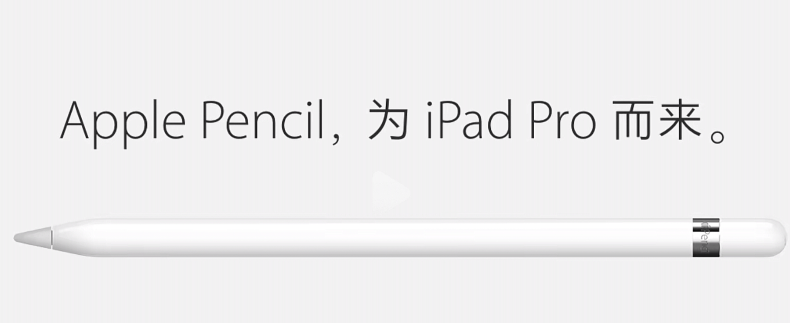

这个在一开始最早Newton 产品上出现的，乔布斯大骂傻逼设计的产品，还说出了“上帝给人类发明了10支手写笔，为什么还要多弄一个 ”这句话

是因为 产品定位。

因为2015年之前一直作为娱乐消费品，但是得益于摩尔定律，随着手机和电脑的上下发展（手机变大，电脑变便携），

ipad作为消费品变得越来越可有可无，以至于ipad的销量在那几年增长就开始停滞了

所以自2015年ipad pro系列定位就是专业性，生产力工具。而 Apple Pencil 的发布slogan就是为ipad pro而来

