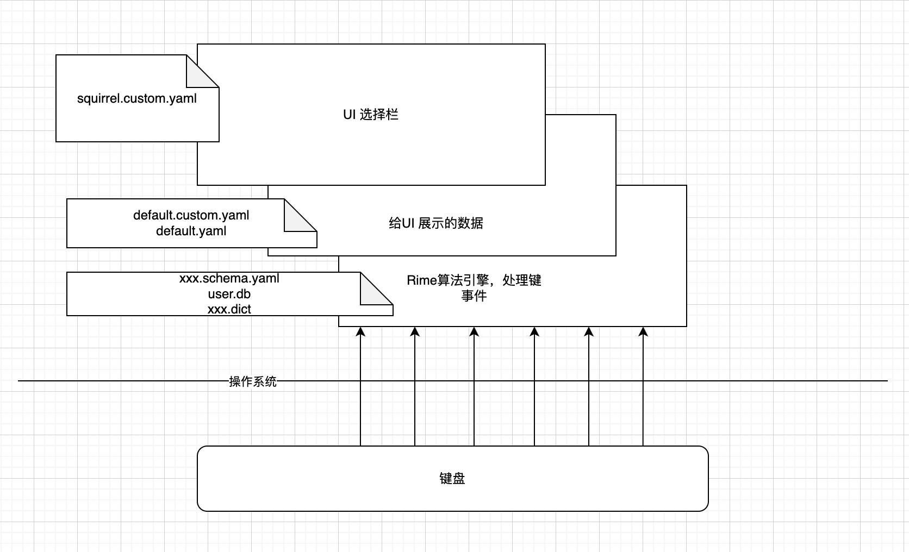

记录一下折腾 [Rime](https://rime.im/) 的过程

如果让我用一句话来描述 Rime 的优点，那就是模块化的设计。

这与其他提供的输入法，比如微软，苹果自带，搜狗，讯飞，百度输入法等相比，可以实现更多环节上的自定义。这就是自由的味道

而在使用中Rime区别与其他输入法最大的不同就是 Rime 能够记住不同session的状态。在我们使用输入法的过程中，经常会遇到一种情况是比方我在浏览器和编辑器之间来回切换，在浏览器找资料，用中文输入，然后切换回编辑器用英文写代码，这时候输入法也需要来回的切换，有时候就很不方便。Rime可以做到切换应用的时候不用切换中英文状态，因为他会记住你在这个应用的停留状态。

不过我感觉 Rime 的文档写的虽然很多，但是感觉很乱。不过可以先看 [必知必会](https://github.com/rime/home/wiki/RimeWithSchemata) 了解一下各个基本概念。

这里就简单的介绍一下怎么用,

## Rime和Squirrel，Weasel, fcitx-rime是什么关系

Squirrel等其他和Rime的关系就是 C/S 架构

Rime本身是一个输入法算法引擎，作为一个后端的存在，Squirrel是前端，就是我们打字的时候出现的那个选择栏的那个东西


## 一个简单的图示



## 配置：以Squireel为例

Squirrel的默认配置路径是 `/Library/Input Methods/Squirrel.app/Contents/SharedSupport`
这下面的文件中有包含一些输入法方案，以及默认的配置 `default.yaml`

### 配置结构

配置结构主要参考上面的图示,看一下什么配置对应哪个层次

不过有几个注意点：

1. 自定义配置，需要在 `~/Library/Rime` 这个路径下面创建 `default.custom.yaml`
2. 这个 `default.custom.yaml` 配置要以 patch 的方式，也就是全部配置都在一个 `patch` 字段下， patch要小写
3. 被patch的字段会覆盖 `default.yaml` 中的字段

### squirrel.custom.yaml

这个配置是对选择栏，UI界面的配置

比如默认的是竖着的，如果你想配置横着的，可以设置 `style/horizontal:true`

其他可以配置的有

```yaml
# 適用於【鼠鬚管】0.9.13+
# 位置：~/Library/Rime/squirrel.custom.yaml
# 用法：想要哪項生效，就刪去該行行首的#字符，但注意保留用於縮進的空格

patch:
#  us_keyboard_layout: true      # 鍵盤選項：應用美式鍵盤佈局
#  show_notifications_when: growl_is_running  # 狀態通知，默認裝有Growl時顯示，也可設爲全開（always）全關（never）
#  style/horizontal: true        # 候選窗横向顯示
#  style/inline_preedit: false   # 非內嵌編碼行
#  style/font_face: "儷黑 Pro"    # 我喜歡的字體名稱
#  style/font_point: 21          # 字號
#  style/corner_radius: 10       # 窗口圓角半徑
#  style/border_height: 0        # 窗口邊界高度，大於圓角半徑才有效果
#  style/border_width: 0         # 窗口邊界寬度，大於圓角半徑才有效果
#  style/color_scheme: luna      # 選擇配色方案

# 註：預設的配色方案及代碼（指定爲 style/color_scheme ）
#   系統默認色系 - native
#   碧水 - aqua
#   青天 - azure
#   明月 - luna
#   墨池 - ink
#   孤寺 - lost_temple
#   暗堂 - dark_temple
#   星際我爭霸 - starcraft
#   谷歌 - google
#   曬經石 - solarized_rock
#   简约白 - clean_white
```

### default.custom.yaml

这个配置就是自定义配置，最常见的配置就是配置输入法方案，切换输入法方案的快捷键是 C-`

```yaml
patch:
  schema_list:
    - schema: double_pinyin_mspy
  menu:
    page_size: 6
```


### 东风破装双拼方案

https://github.com/rime/plum

可以直接帮助你安装其他的输入法方案，就比如双拼方案

## 既然有了Squirrel为啥还要弄Emacs-Rime？

引用Emacs社区大佬猫大的一段话

> 你分屏一个写文章，一个写代码，用内置输入法就可以每个窗口保持自己的输入法状态，不用来回切换输入法。用系统输入法，系统输入法会把emacs当做一个软件来保存输入状态，会导致emacs内部切换不同窗口需要来回切换输入法，打断思路。


Emacs-Rime其实就是另一个输入法前端，类似Squirrel的存在

所以这两个用户资料配置  `rime-user-data-dir` 需要不一样，不然的话，会覆盖 `user.db` 等这些数据

共享资料配置还是一样的


### 自动化流程配置
Emacs-Rime 可以实现中西文混合输入，主要是因为 `rime-predicate-xxx`，这大大的提高了效率，因为不用切换中英文


#### `rime-predicate-space-after-cc-p` 和 `rime-predicate-space-after-ascii-p` 不要混用

前者是输入中文后，空一格，然后就会自动暂时切换到英文，然后就可以输入英文
后者是在一段英文和空格后，也会自动暂时切换到英文模式，不要和前者混着，是因为前者在暂时切换到英文，你输入了英文，然后后者发现英文+空格，还是切换到英文，这样就回不到中文了

如果你在中文模式下工作，中途暂时需要输入一些英文，就配置前者就可以了

#### 输入英文符号

比如在md文件里面，有时候需要插入链接，链接在md文件中是 `[]()`的格式，但如果没有正确配置会发现怎么输入的都是中文符号

这是因为需要配置
1. `(rime-inline-ascii-trigger 'shift-l)`
2. `(setq rime-inline-ascii-holder ?x)`

1同时需要

```yaml
  ascii_composer:
    good_old_caps_lock: true
    switch_key:
      Shift_L: inline_ascii
      Shift_R: commit_text
      Control_L: noop
      Control_R: noop
      Caps_Lock: clear
      Eisu_toggle: clear
```

`Shift-L: inline_ascii` 也是同样的 `shift-l`

注意，这个 `shift-l` 不是让你去按的。

如果自动化满足不了需求，最后的大招就是 `C-\` 把输入法关掉，输入英文，然后再开起来，这就变相的实现中西文的切换

### posframe

默认的选择栏是在minibuffer中， [posframe](https://github.com/tumashu/posframe) 可以实现像普通的输入法一样，跟随光标

### 我的配置

```lisp
;;input
(require 'posframe)

(use-package rime
  :custom
  (rime-translate-keybindings '("C-f" "C-b" "C-n" "C-p" "C-g" "<left>" "<right>" "<up>" "<down>" "<prior>" "<next>" "<delete>" "C-a" "C-e" "C-d" "C-k"))
  (rime-librime-root "~/.emacs.d/librime/dist")
  (rime-user-data-dir "~/.config/emacsrime")
  (rime-posframe-properties (list :background-color "#333333"
				  :foreground-color "#dcdccc"
				  :internal-border-width 10))
  (rime-disable-predicates '(rime-predicate-prog-in-code-p
			     rime-predicate-org-in-src-block-p
			     rime-predicate-org-latex-mode-p
			     rime-predicate-in-code-string-p))
  (rime-inline-predicates '(rime-predicate-space-after-cc-p ;;在中文字符且有空格之后
			    rime-predicate-current-uppercase-letter-p ;;将要输入的为大写字母时
			    ;;rime-predicate-current-input-punctuation-p ;; 当要输入的是符号时
			    rime-predicate-punctuation-after-space-cc-p ;; 当要在中文字符且有空格之后输入符号时
			    rime-predicate-punctuation-line-begin-p ;;在行首要输入符号时
			    ))
  (rime-inline-ascii-holder ?x)
  (mode-line-mule-info '((:eval (rime-lighter))))
  (rime-inline-ascii-trigger 'shift-l)
  (rime-show-candidate 'posframe)
  (default-input-method "rime")
  :bind
  (:map rime-active-mode-map
	("M-j" . 'rime-inline-ascii)
   :map rime-mode-map
	("M-j" . 'rime-force-enable)
	("C-`" . 'rime-send-keybinding)
	))


(provide 'init-rime)
```


## 参考文档

[自由输入法 RIME 简明配置指南](https://sspai.com/post/84373%20%E3%80%94%E6%96%B9%E6%A1%88%E9%81%B8%E5%96%AE%E3%80%95)

[emacs-rime](https://github.com/DogLooksGood/emacs-rime?tab=readme-ov-file)
