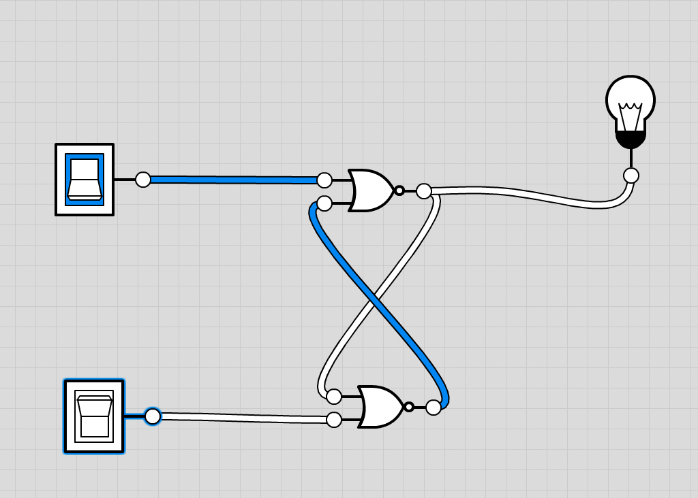
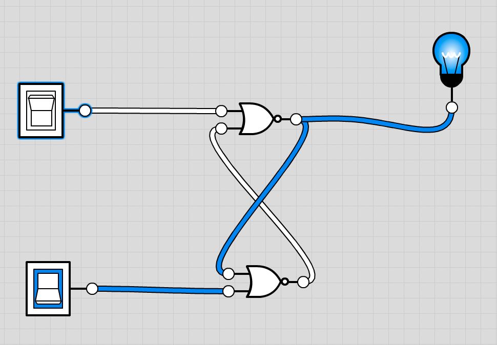
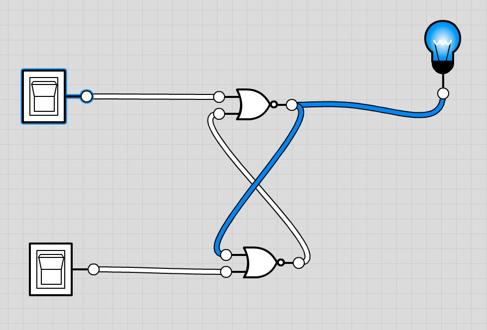
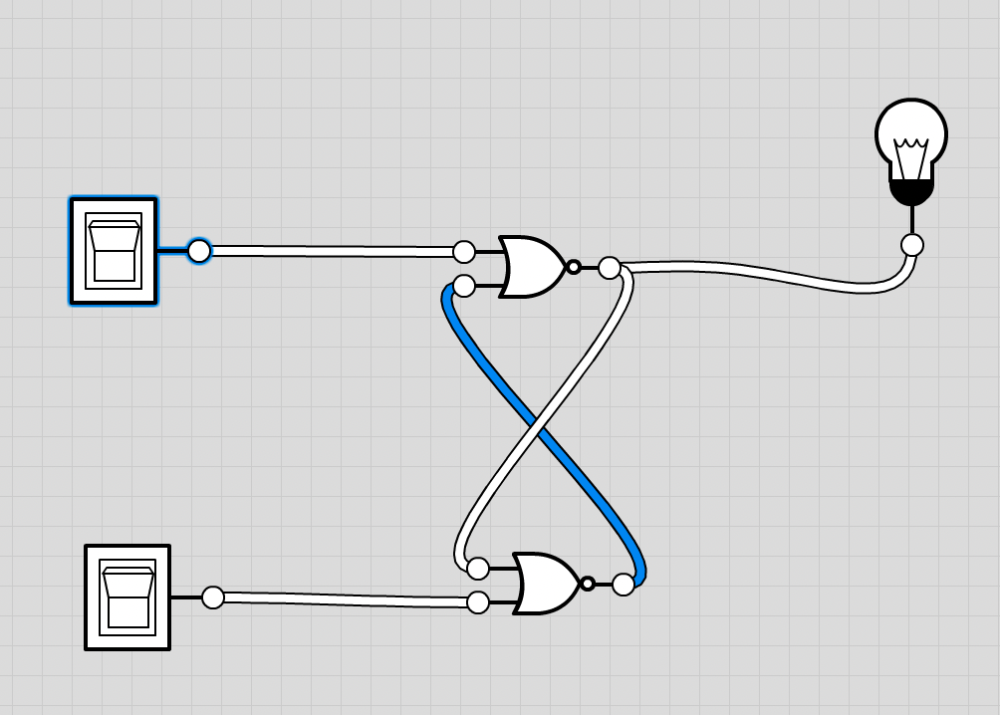
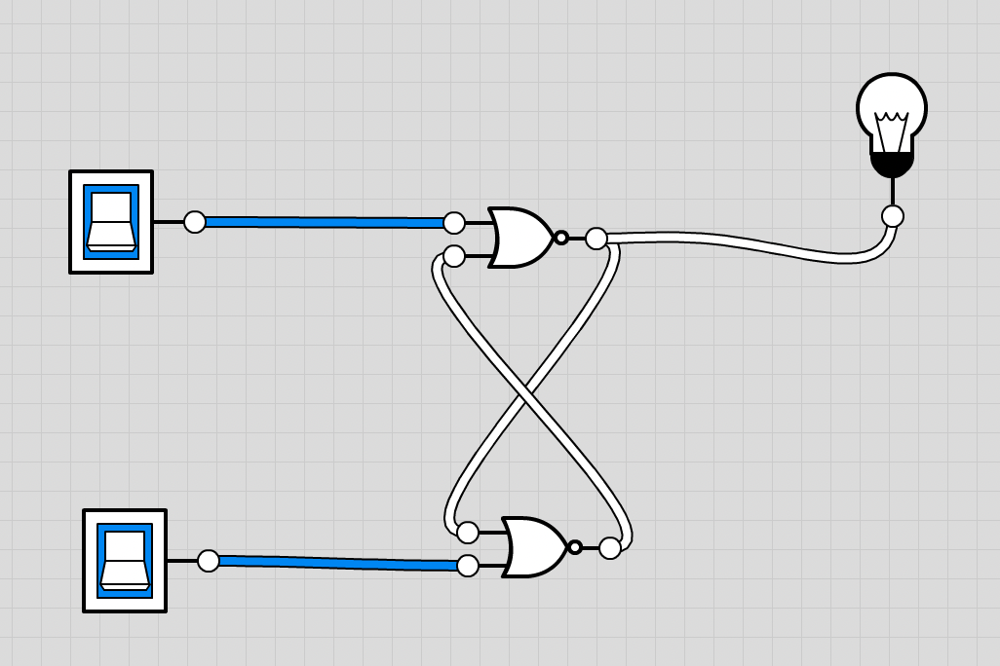
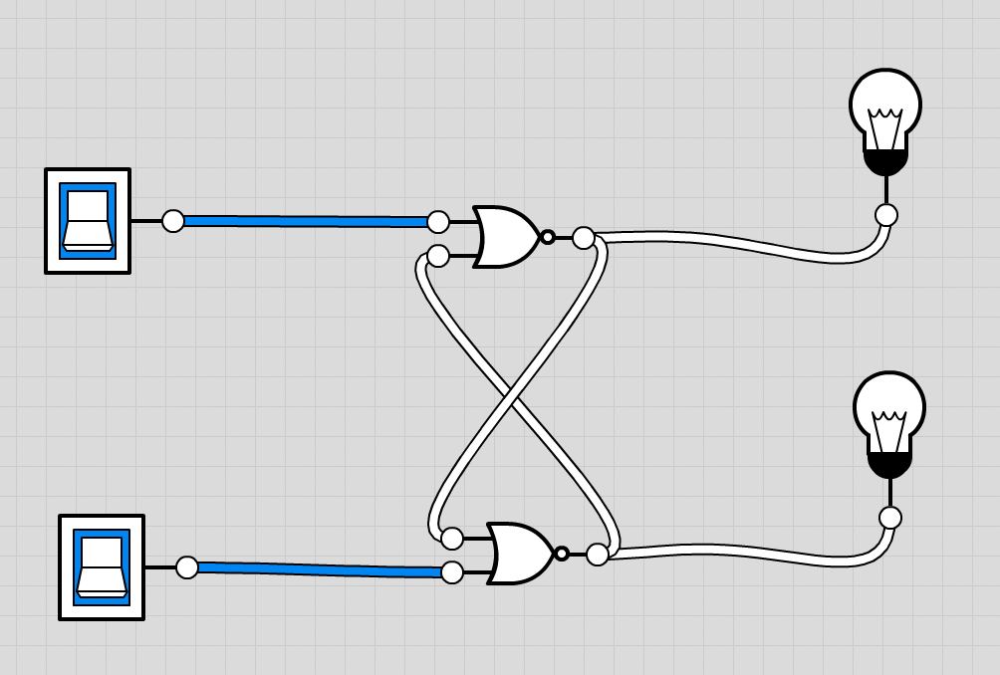

RS触发器可以由或非门组成， as well as 与非门！！！

这里以或非门举例

## RS触发器状态

### R:1 S:0

### R:0 S:1

### R:0 S:0

怎么出现了两种情况，其实是因为在 R=0,S=0的状态下，它是保持上一个状态的意思

### R:1 S:1

但是实际上，我们再接一个

这样就可以看出来了

因为RS触发器，逻辑上我们需要输出的两个是 Q和Q非，它两逻辑上应该是互为相反的，但是R1S1的时候是一样的，所以**其实这个输入状态是禁止使用的**

> 或非门时 R = S = 1 时禁止，因为Q和Q非输出都是0；为了方便记忆，可以认为非门时，1 强于 0，所有反馈无法改变和 1 的非值，RS触发器也就无法自我调节

> 与非门时 R = S = 0 时禁止，因为Q和Q非输出都是1；为了方便记忆，可以认为与门时，0 强于 1，所有反馈无法改变和 0 的与值，RS触发器也就无法自我调节

## RS触发器作用
**存储数据！**

**存储数据！**

**存储数据！**

也就是，如果要写入1或0，那就输入 R0S1，或R1S0

如果要读取数据，那就R0S0
