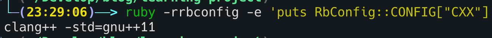

## 问题
今天我在 `gem install jekyll bundle` 的时候，一直出现一个问题就是

```
/Users/mmmmmcclxxvii/.gem/ruby/3.4.1/gems/jekyll-4.3.4/lib/jekyll.rb:26: warning: logger was loaded from the standard library, but will no longer be part of the default gems starting from Ruby 3.5.0.
You can add logger to your Gemfile or gemspec to silence this warning.
/Users/mmmmmcclxxvii/.gem/ruby/3.4.1/gems/jekyll-4.3.4/lib/jekyll.rb:28: warning: csv was loaded from the standard library, but is not part of the default gems starting from Ruby 3.4.0.
You can add csv to your Gemfile or gemspec to silence this warning.
bundler: failed to load command: jekyll (/Users/mmmmmcclxxvii/.gem/ruby/3.4.1/bin/jekyll)
/Users/mmmmmcclxxvii/.rubies/ruby-3.4.1/lib/ruby/3.4.0/bundled_gems.rb:82:in 'Kernel.require': cannot load such file -- csv (LoadError)
    from /Users/mmmmmcclxxvii/.rubies/ruby-3.4.1/lib/ruby/3.4.0/bundled_gems.rb:82:in 'block (2 levels) in Kernel#replace_require'
    from /Users/mmmmmcclxxvii/.gem/ruby/3.4.1/gems/jekyll-4.3.4/lib/jekyll.rb:28:in '<top (required)>'
    from /Users/mmmmmcclxxvii/.rubies/ruby-3.4.1/lib/ruby/3.4.0/bundled_gems.rb:82:in 'Kernel.require'
    from /Users/mmmmmcclxxvii/.rubies/ruby-3.4.1/lib/ruby/3.4.0/bundled_gems.rb:82:in 'block (2 levels) in Kernel#replace_require'
    from /Users/mmmmmcclxxvii/.gem/ruby/3.4.1/gems/jekyll-4.3.4/exe/jekyll:8:in '<top (required)>'
    from /Users/mmmmmcclxxvii/.gem/ruby/3.4.1/bin/jekyll:25:in 'Kernel#load'
    from /Users/mmmmmcclxxvii/.gem/ruby/3.4.1/bin/jekyll:25:in '<top (required)>'
    from /Users/mmmmmcclxxvii/.gem/ruby/3.4.1/gems/bundler-2.6.2/lib/bundler/cli/exec.rb:59:in 'Kernel.load'
    from /Users/mmmmmcclxxvii/.gem/ruby/3.4.1/gems/bundler-2.6.2/lib/bundler/cli/exec.rb:59:in 'Bundler::CLI::Exec#kernel_load'
    from /Users/mmmmmcclxxvii/.gem/ruby/3.4.1/gems/bundler-2.6.2/lib/bundler/cli/exec.rb:23:in 'Bundler::CLI::Exec#run'
    from /Users/mmmmmcclxxvii/.gem/ruby/3.4.1/gems/bundler-2.6.2/lib/bundler/cli.rb:452:in 'Bundler::CLI#exec'
    from /Users/mmmmmcclxxvii/.gem/ruby/3.4.1/gems/bundler-2.6.2/lib/bundler/vendor/thor/lib/thor/command.rb:28:in 'Bundler::Thor::Command#run'
    from /Users/mmmmmcclxxvii/.gem/ruby/3.4.1/gems/bundler-2.6.2/lib/bundler/vendor/thor/lib/thor/invocation.rb:127:in 'Bundler::Thor::Invocation#invoke_command'
    from /Users/mmmmmcclxxvii/.gem/ruby/3.4.1/gems/bundler-2.6.2/lib/bundler/vendor/thor/lib/thor.rb:538:in 'Bundler::Thor.dispatch'
    from /Users/mmmmmcclxxvii/.gem/ruby/3.4.1/gems/bundler-2.6.2/lib/bundler/cli.rb:35:in 'Bundler::CLI.dispatch'
    from /Users/mmmmmcclxxvii/.gem/ruby/3.4.1/gems/bundler-2.6.2/lib/bundler/vendor/thor/lib/thor/base.rb:584:in 'Bundler::Thor::Base::ClassMethods#start'
    from /Users/mmmmmcclxxvii/.gem/ruby/3.4.1/gems/bundler-2.6.2/lib/bundler/cli.rb:29:in 'Bundler::CLI.start'
    from /Users/mmmmmcclxxvii/.gem/ruby/3.4.1/gems/bundler-2.6.2/exe/bundle:28:in 'block in <top (required)>'
    from /Users/mmmmmcclxxvii/.gem/ruby/3.4.1/gems/bundler-2.6.2/lib/bundler/friendly_errors.rb:117:in 'Bundler.with_friendly_errors'
    from /Users/mmmmmcclxxvii/.gem/ruby/3.4.1/gems/bundler-2.6.2/exe/bundle:20:in '<top (required)>'
    from /Users/mmmmmcclxxvii/.gem/ruby/3.4.1/bin/bundle:25:in 'Kernel#load'
    from /Users/mmmmmcclxxvii/.gem/ruby/3.4.1/bin/bundle:25:in '<main>'
```

然后我在 [eventmachine(1.2.7) installation issue on Intel mac with ruby 3.3.0](https://github.com/eventmachine/eventmachine/issues/990) 得到解决方案

## 原因
如果你也遇到类似的问题，请先执行

`ruby -rrbconfig -e 'puts RbConfig::CONFIG["CXX"]'`

如果结果是`false` 那么基本上你需要重新安装 `XCode CLT` 和 `ruby` 来解决上述的问题

正常的结果应该是



## 解决方案

```
# Uninstall XCode CLT
% sudo rm -rf /Library/Developer/CommandLineTools

# Reinstall XCode CLT
% sudo xcode-select --install
% softwareupdate --all --install --force

# uninstall ruby
# reinstall ruby
```

建议使用 `ruby-install` 和 `chruby` 来安装管理 ruby

