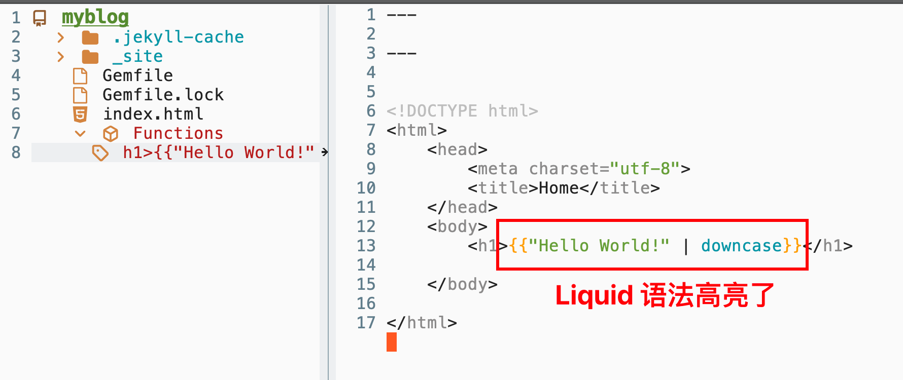

最终效果




因为如果直接打开 `.html` 的话, `web-mode` 检测到 `html` 文件，但是不会对`Liquid` 语法做处理

但如果更改后缀，比如 `.djhtml`,`.tmpl` 那么又会失去对`html` 本身的支持。


这时候需要我们配置 `mode + engine`

参考[Associate an engine](https://web-mode.org/)

>A specific engine can be forced with web-mode-engines-alist.

```lisp
(setq web-mode-engines-alist
      '(("php"    . "\\.phtml\\'")
        ("blade"  . "\\.blade\\."))
)
```

> Using this association list is required as soon as the file extension is unknown (by web-mode) or is too general (e.g. *.html). In summary, you may have to set both auto-mode-alist and web-mode-engines-alist.
> Since the version v10, you can also put a fragment like -*- engine:ENGINE_NAME -*- in a comment at the beginning of your template (web-mode-enable-engine-detection must be set to t in your .emacs)

```lisp
<?php /* -*- engine:php -*- */ ?>
<span><?=$x?></span>
```


使用`-*- engine:ENGINE_NAME -*-` 方法看来是最方便的，但是有一个问题是，`jekyll`需要使用`front matter`,这导致首行如果添加了这个comment的话，jekyll解析就有点问题


所以我现在的解决方法还是hook

我这里检测是不是jekyll项目的逻辑主要是当前项目中是不是有Gemfile.lock以及这个文件中有没有jekyll依赖

```lisp
(defun web-mode/treesit-parser-hook ()
  "Create a Tree-sitter parser based on the file extension and project type."
  (let ((file-name (buffer-file-name)))
    (when file-name
      (let* ((extension (file-name-extension file-name))
             (gemfile-lock-path (locate-dominating-file default-directory "Gemfile.lock"))
             (is-jekyll-project
              (when gemfile-lock-path
                (with-temp-buffer
                  (insert-file-contents (expand-file-name "Gemfile.lock" gemfile-lock-path))
                  (search-forward "jekyll" nil t))))
             (language (pcase extension
                         ("vue" 'vue)
                         ("djhtml" 'htmldjango)
                         ("tmpl" 'liquid)
                         ("html" (if is-jekyll-project 'liquid 'html))
                         ("php" 'php))))
	(if is-jekyll-project
	    (add-to-list 'web-mode-engines-alist '("liquid" . "\\.html\\'"))
	  (setq web-mode-engines-alist
		(cl-remove-if (lambda (x) (equal x '("liquid" . "\\.html\\'")))
			      web-mode-engines-alist)))
        (when language
          (treesit-parser-create language))
	(message "using...%s" language)))))

(add-hook 'web-mode-hook #'web-mode/treesit-parser-hook)

```
