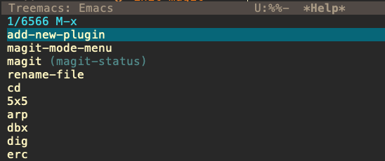

# Emacs 内置的补全


Emacs默认的补全是这样的 vertico 的作用,顾名思义,就是把所有的候选项变成竖直展现

# Vertico

```lisp
(require 'vertico)

(vertico-mode)

(provide 'init-vertico)
```

安装完的效果如下


# orderless

> Advanced completion style

它的作用是模糊匹配,使用前


配置后


```lisp
(require 'orderless)

(setq completion-styles '(orderless basic)
      completion-category-overrides '((file (styles basic partial-completion))))

(provide 'init-orderless)

```
这里 `completion-styles` 优先选择 orderless 无序匹配

这里的 `completion-category-overrides` 的意思是,针对后面的类型另外定义补全类型,也就是覆盖上面全局的 `completion-styles`

比如这里的file 类型,选择还是原来的基础匹配,部分匹配,而不是无序匹配,因为路径如果前后可以颠倒的话那么可能会造成过滤显示结果的不精确


# marginalia

> Rich annotations in the minibuffer

margin 的其中一个意思就是在书本白边处的笔记

那么配置这个后,在 minibuffer 就可以直接显示命令的定义等

对比





# consult

> Useful search and navigation commands

比如 搜索使用 `C-s` 的时候, 默认是在 `buffer` 中跳转, 使用 `consult-line` 后,可以在 `minibuffer` 中显示结果, 非常 nice

```lisp
(global-set-key (kbd "C-s") 'consult-line)
``


# embark & embark-consult

> Action commands, which can act on the completion candidates

旨在简化基于当前点附近上下文选择和运行命令的过程。它在 minibuffer 完成会话和普通缓冲区中均适用，通过绑定 embark-act 命令到某个键，可依据目标类型提供相关动作。Embark 预配置了针对多种常见目标类型（如文件、缓冲区等）的超百种动作，且易于扩展。它还支持将 minibuffer 候选项收集到类似 occur 的缓冲区或导出到特定主模式缓冲区，如 dired、ibuffer 等。此外，Embark 提供了丰富的配置选项，包括自定义目标识别、动作分类及动作绑定等。


以上是最简单的使用方法和配置
