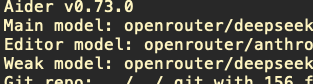
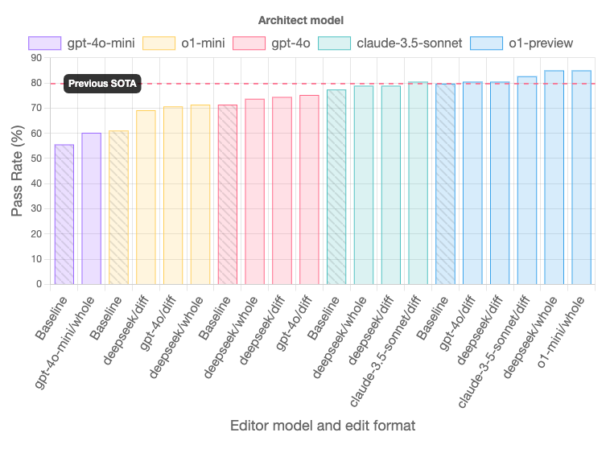
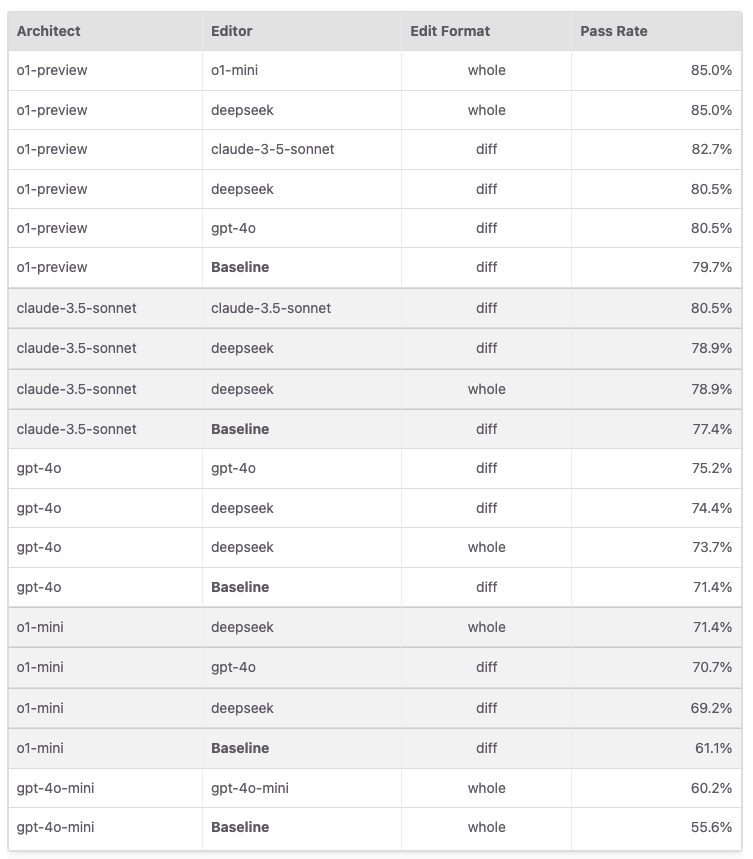

## what's aider

简单的来说 aider 是 cursor, 是 cline

只不过它运行在终端,通过输入命令方式来实现 cursor/cline 的功能

Emacs下有aider的插件

我这里是Emacs下的配置

```lisp

(require 'aider)

;;; Code:
(setq aider-args '(
   "--no-auto-commits"
   "--model" "deepseek/deepseek-reasoner"      ; Architect模型（方案设计）
   "--editor-model" "openrouter/anthropic/claude-3.5-sonnet"    ; Editor模型（代码实现）
   "--edit-format" "diff"                  ; 主模型使用标准diff格式（要求模型返回diff格式的代码变更）使用默认的就行 optimal
   "--editor-edit-format" "editor-diff"    ; Editor模型使用优化后的diff格式（精简指令的diff格式）
   "--architect"                           ; 默认启用architect模式
))

(setenv "DEEPSEEK_API_KEY" (with-temp-buffer
                               (insert-file-contents "~/.config/aider/deepseek.txt")
                               (string-trim (buffer-string))))


(setenv "OPENROUTER_API_KEY" (with-temp-buffer
                               (insert-file-contents "~/.config/aider/openrouter.txt")
                               (string-trim (buffer-string))))


(global-set-key (kbd "C-,") 'aider-transient-menu)

(provide 'init-aider)

```

有两种方式的配置, `aider-args` 和 `setenv` 其实前者就是类似命令行 `aider --xxx -xxx --xx` 这样去执行命令,这些参数在一开始就传递过去

`setenv`这种方式,或者在用户目录下面建一个 `.env` / `.aider.conf.yml` 文件,aider启动的时候会去加载这个配置文件.

## aider中的 main-model,weak-model是什么意思

当启动 aider 的时候, 会显示



这里的 main-model 就是主要用到的大模型

什么时候用到 weak-model 呢? 就是在aider 认为这些任务都比较简单的时候,会去使用 weak-model, 这样可以减少cost

## aider 中有多少模式?

如果你在使用中感觉有好多 `xxx-mode` ,把你搞乱了, 什么`editor-mode`, `code-mode`, `chat-mode`等等好多. ok 我们梳理一下


上面所有的都叫 `chat-mode` , 它就像一个一级目录一样

然后其实总共也就4个 mode, 分别是 `code`,`architect`,`ask`,`help` 这四个

我们可以通过 `/chat-mode architect` 命令来切换不同的模式

`code` 模式是不管三七二十一,你问什么,他就会根据回答去改动相应源代码文件

`architect`模式,是先给出修改方案,然后会询问你需不需要修改,当你同意修改,才会去修改文件

`ask`模式,就是一个问答,永远不会动源代码

`help`模式,是询问使用 aider 过程一些问题用的,它默认会去读aider的文档

## architect和editor-mode 又是什么关系


上面说了其实总共只有4种 mode ,那么 `editor-mode` 又是什么?


是这样的, `architect` 包含 `editor-mode`, 或者说,其实是 `architect/editor-mode`


这个模式下会有两个阶段,就是给出代码修改方案,和执行代码修改

那么因为有些模型它的推理能力比较强,它可以在前面阶段发挥作用,而有些模型,它处理代码能力更强,他可以用来后面的代码执行阶段

所以可以使用 `--editor-model` 参数来指定构建阶段使用的大模型

下面是 aider 官方的测试搭配效果





## 什么是 edit-format


这里就介绍两种`whole`和`diff`

如果设置了 `whole`, 那么大模型会返回你需要修改的所有源代码文件的所有代码,即使你可能只需要更改一行代码

如果设置了 `diff`,那么大模型会返回只需要修改的部分的代码

那么显然前者更费钱. 但优势是简单粗暴. 在构建新文件的时候可以使用,这样前后代码更连贯


## 参考
[aider.el](https://github.com/tninja/aider.el/tree/main)
[Yaml config file](https://aider.chat/docs/config/aider_conf.html)
[Config with .env](https://aider.chat/docs/config/dotenv.html)
[Separating code reasoning and editing](https://aider.chat/2024/09/26/architect.html)
[Edit formats](https://aider.chat/docs/more/edit-formats.html#editor-diff-and-editor-whole)
