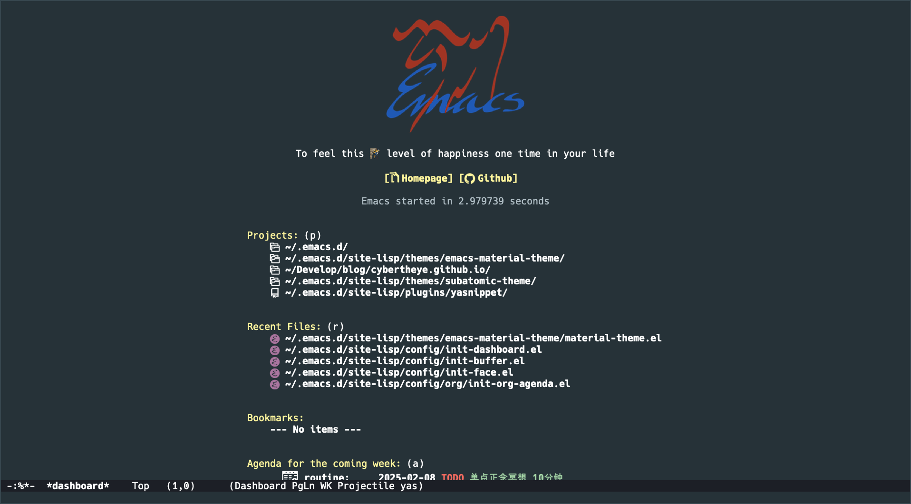
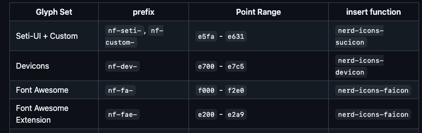

# [Dashboard](https://github.com/emacs-dashboard/emacs-dashboard?tab=readme-ov-file)

我配置最终的样式




读一篇 readme 其实配置基本没什么问题,我这里就记录一下我碰到的几个问题

## 使用 nerd-icons

`(,(nerd-icons-faicon "nf-fa-blogger_b" :height 1.1 :v-adjust 0.0)`

我一开始看文档,



我以为 `nf-fa` 部分,不需要输入,也就是 `nerd-icons-faicon "blogger_b"` 这样

但是不是这样的,还是要输入的 `nf-fa`的


## 打开 heading-icon 报错

就是不知道什么原因, `dashboard-heading-icons` 最终设置错误,

我遇到这个报错的时候,这个值只有两个,但是我 `dashboard-item` 有5个, `project`, `recents`,`bookmark`,`register`,`agenda`

所以其他三个自然就是 nil ,所以报错了,

解决方式就是手动的 setq 一下

```lisp
(setq dashboard-heading-icons '((recents . "nf-oct-history")
	                            (bookmarks . "nf-oct-bookmark")
                				(agenda . "nf-oct-calendar")
				                (projects . "nf-oct-rocket")
				                (registers . "nf-oct-database")))
```
[nil icon name when dashboard-set-heading-icons turned on](https://github.com/emacs-dashboard/emacs-dashboard/issues/459)

## 设置 page-break-line

```lisp
(with-eval-after-load 'page-break-lines
  (setq dashboard-page-separator "\n\f\n") ;; 必须要加这一行,才能显示出 page line
  (dashboard-insert-page-break))
```

但我觉得 `page-break-line` 加了不好看


## 我的完整配置

```lisp
(require 'dashboard)
(require 'dashboard-widgets)

(dashboard-setup-startup-hook)


(setq dashboard-startup-banner 'logo)

(setq dashboard-banner-logo-png "/Users/mmmmmcclxxvii/Works/cyven/820x312.png")

;; Set the title
(setq dashboard-banner-logo-title "To feel this 🧗 level of happiness just one time in your life")
;; Content is not centered by default. To center, set
(setq dashboard-center-content t)
;; vertically center content
(setq dashboard-vertically-center-content t)

(with-eval-after-load 'projectile
  (setq dashboard-projects-backend 'projectile)
  (add-to-list 'dashboard-items '(projects . 5)))

(add-to-list 'dashboard-items '(registers . 5) t)


(setq dashboard-startupify-list '(dashboard-insert-banner
                                  dashboard-insert-newline
                                  dashboard-insert-banner-title
                                  dashboard-insert-newline
                                  dashboard-insert-navigator
                                  dashboard-insert-newline
                                  dashboard-insert-init-info
                                  dashboard-insert-items
                                  dashboard-insert-newline
                                  dashboard-insert-footer))

(setq dashboard-navigation-cycle t)

(with-eval-after-load 'nerd-icons
  (setq dashboard-display-icons-p t)     ; display icons on both GUI and terminal
  (setq dashboard-icon-type 'nerd-icons) ; use `nerd-icons' package
  (dashboard-modify-heading-icons '((recents   . "nf-oct-file_code")
                                    (bookmarks . "nf-oct-book")))
;;如果 heading-icons 设置有问题,取消下面的注释
;;(setq dashboard-heading-icons '((recents . "nf-oct-history")
;;			  (bookmarks . "nf-oct-bookmark")
;;			  (agenda . "nf-oct-calendar")
;;			  (projects . "nf-oct-rocket")
;;			  (registers . "nf-oct-database")))

  (setq dashboard-set-heading-icons t)
  (setq dashboard-set-file-icons t)

  ;; Format: "(icon title help action face prefix suffix)"
  (setq dashboard-navigator-buttons
	`(;; line1
          (
	   (,(nerd-icons-faicon "nf-fa-blogger_b" :height 1.1 :v-adjust 0.0)
            "Homepage"
            "Browse homepage"
            (lambda (&rest _) (browse-url "https://www.cybertheye.com")))

           (,(nerd-icons-octicon "nf-oct-mark_github" :height 1.1 :v-adjust 0.0)
            "Github"
            ""
            (lambda (&rest _) (browse-url "https://github.com/cybertheye")))
           )))

)


(setq dashboard-agenda-sort-strategy '(scheduled-up deadline-up category-keep priority-down))


;; 加了 page-break-line 感觉不好看
;;(with-eval-after-load 'page-break-lines
;;  (setq dashboard-page-separator "\n\f\n") ;; 必须要加这一行,才能显示出 page line
;;  (dashboard-insert-page-break))
;;(page-break-lines-mode))

(provide 'init-dashboard)

```
