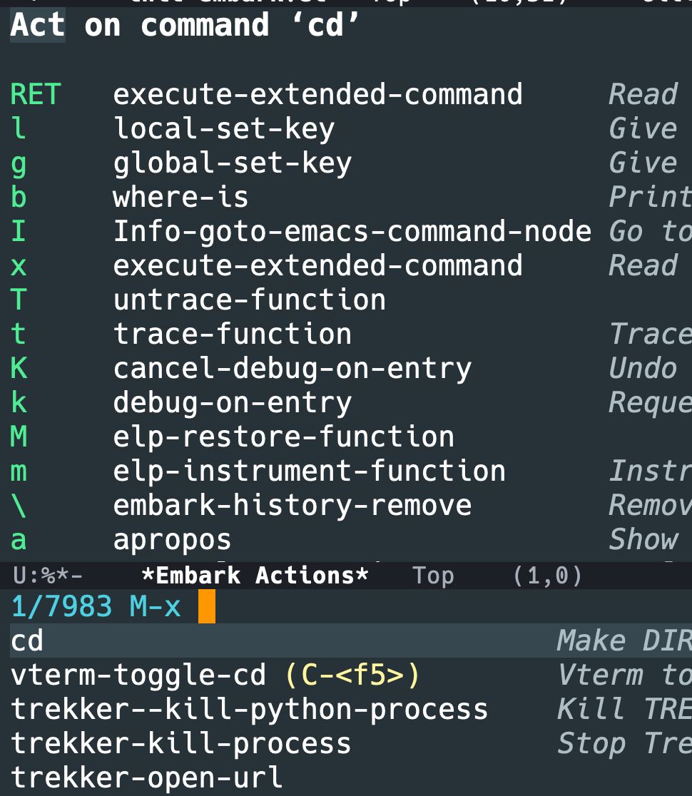
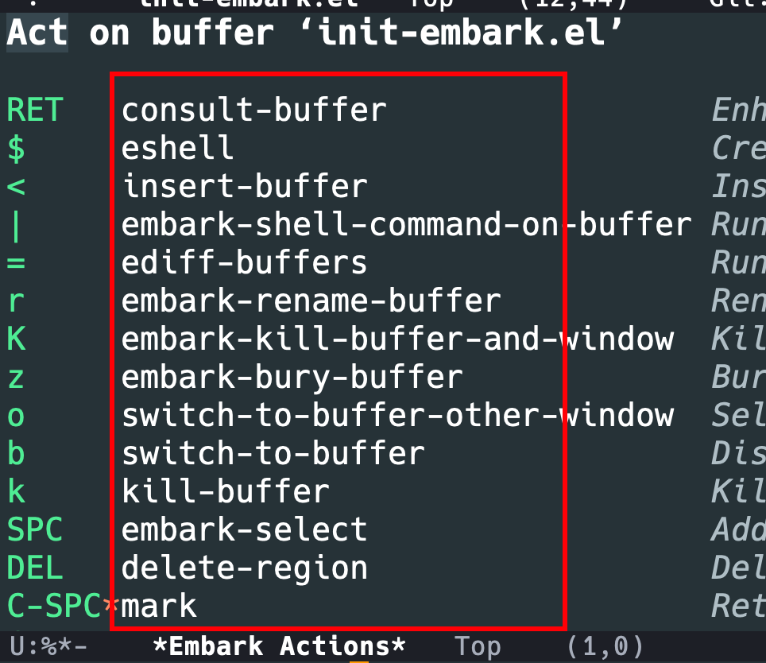
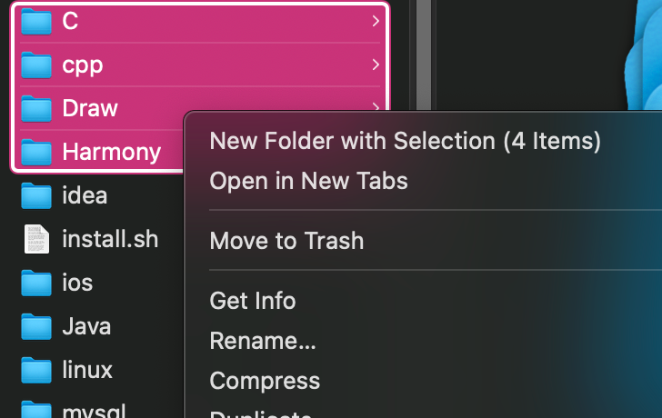
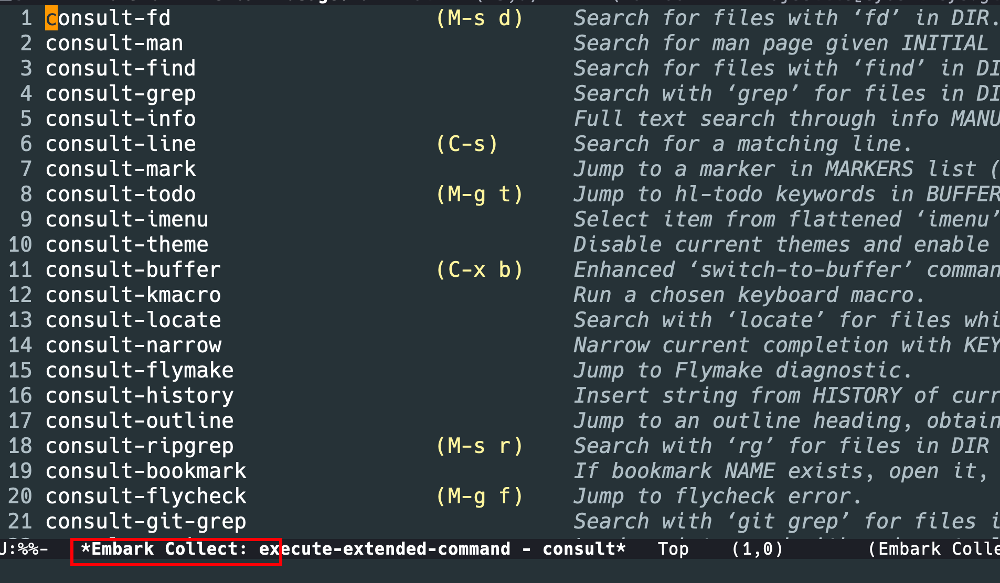

## Embark 是什么?

Embark Emacs 版的右键菜单栏, 在minibuffer的候选项上可以使用,普通的buffer中,使用也可以选中来使用 Embark

## 快速使用

绑定一个快捷键

`(global-set-key (kbd "C-;") 'embark-act)`

然后可以在`find-file`,`switch buffer`,`M-x`等唤出 minibuffer 使用

## "右键菜单栏"的方法

其实总共两个,`embark-act`和`embark-act-all`,可以呼出以下界面.

这里的红框都是某个 `action`

`embark-act-all`就是在多选的情况去右键然后选择某个操作.

## 选择

就像电脑操作逻辑一样,我们可以通过选择多个,然后一起右键

Embark 里面也有这样的操作,就是 `embark-select`,然后再 `embark-act-all`

## 导出

有两个, `embark-collect`和`embark-export`可以将多个 candidates 放到一个临时的buffer中去

###  embark-collect 和 embark-export 有什么区别,选择哪一个

| 特性       | embark-collect             | embark-export                        |
|------------|----------------------------|--------------------------------------|
| 目的       | 临时收集目标，方便批量操作 | 将目标导出为静态内容，方便保存或编辑 |
| 缓冲区类型 | 临时缓冲区，动态更新       | 普通缓冲区，静态内容                 |
| 使用场景   | 批量操作、动态查看结果     | 保存结果、长期编辑                   |
| 是否可保存 | 不能直接保存               | 可以保存为文件                       |

## embark-consult

embark-consult 提供了一些 exporter,collectors,也会对一些consult方法做一些细微的改动

### 结合wgrep

可以实现在一个项目下面对多个文件的字符替换,实现重构

工作流是 `consult-ripgrep` 搜索 -> `embark-exporter` 到一个 grep-mode 的 buffer 中 -> `C-c C-p` 使其可编辑 -> replace string 方法 -> `C-c C-e`写入

不过这个可以通过猫大的 `color-rg` 来完成

## 其他

### embark-live

### embark-become

### embark-general-map
