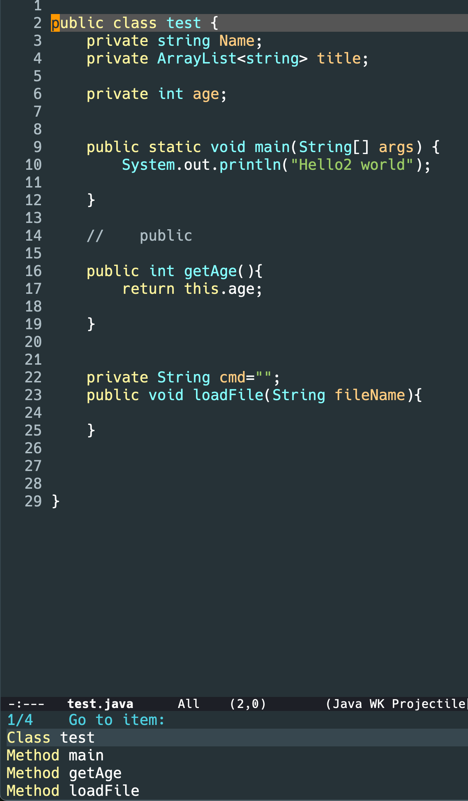

先看效果 在支持 tree-sitter 的 mode 下,

`consult-imenu`是增强版的`imenu`

主要是在当前 mode 下的 `imenu-create-index-function` 的设置,而因为有些 mode 已经是 ts-mode, 比如 java-mode, 我已经 remap 到 java-ts-mode

所以这个 `imenu-create-index-function`的值是 `treesit-simple-imenu`,否则默认的值是 `imenu-default-create-index-function`

但是上面的 java 截图,就没有显示出类属性,是不是这个 `treesit-simple-imenu`没有创建类属性的index? 对的

那有没有 `treesit-complex-imenu` 之类的?

注意 `treesit-simple-imenu` 之所以叫 `simple` 因为他只能解析出编程语言通用的一些结构,比如方法,类, 各个语言的语法不一样,所以如果要显示更加丰富的结构,需要自行定义

