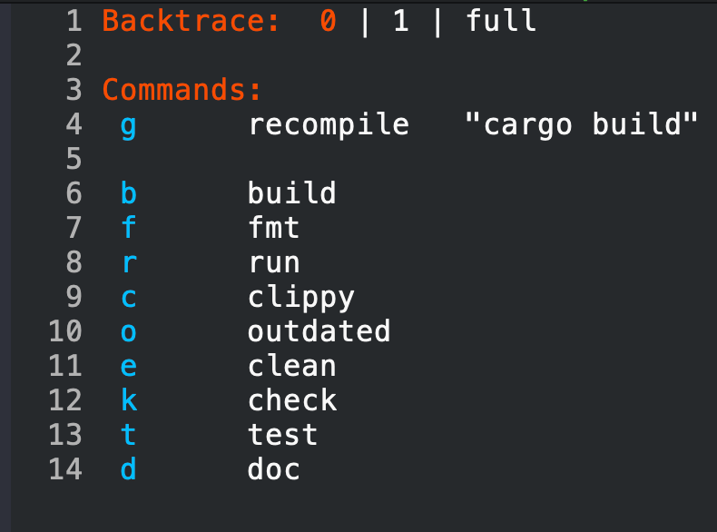
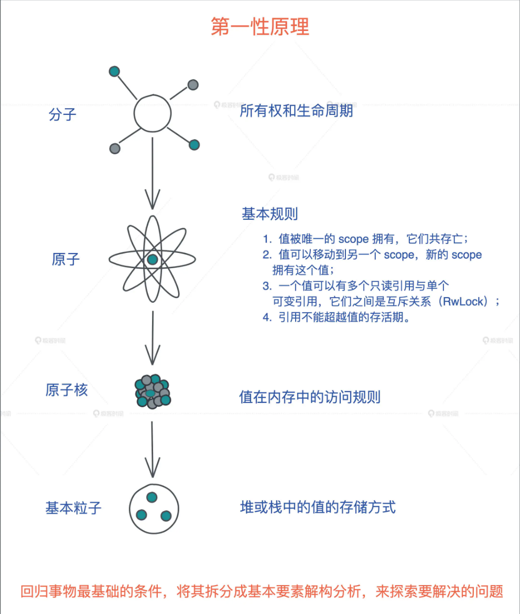

# Table of Contents

1.  [What is Rust](#orgafdd012)
    1.  [什么是zero cost abstractions？](#org6bfb2ac)
2.  [工具汇总](#orga8c6131)
    1.  [Rustup](#org46e3e3a)
    2.  [rustc](#orge06aa87)
    3.  [cargo](#org348d9ff)
    4.  [crates.io](#orgffb15c4)
    5.  [evcxr](#org3ef184c)
    6.  [rust-analyzer](#orgf09dcb5)
3.  [下载安装](#orgf36afea)
4.  [创建工程](#orgc487ae1)
5.  [Emacs 编辑器](#org22a3e09)
    1.  [运行常用命令](#orga18c859)
    2.  [Code Navigation](#org445ce35)
    3.  [文档](#orgfd60d85)
6.  [Rust 思维](#orgc7698f6)
7.  [学习路线](#org94dad9e)
    1.  [书籍](#org183c642)
    2.  [项目](#orgae5f0aa)
    3.  [OJ类型的平台](#orgc5033c4)
    4.  [视频](#org6f40471)
    5.  [社区](#org715c06e)
    6.  [库的学习](#orgc6d7ce0)
    7.  [其他](#org1289da2)
8.  [level](#org6c334e1)

\#+ORG-

# What is Rust {#orgafdd012}

Rust是一门高级编程语言，他专注于性能，安全，并发领域
它通过废除GC机制来达到上述的目标
取而代之的是所有权系统
他的语法和C++接近，但是比C++提供了更多的内存安全性同时还能保证高性能

Rust is a systems programming language that aims to provide memory safety, concurrency,
and performance with a focus on zero cost abstractions

## 什么是zero cost abstractions？ {#org6bfb2ac}

其实就是摒弃了垃圾回收机制，因为那套机制会有时间和空间上的花费

In Rust, memory safety is accomplished through a system of ownership with a set of rules
that the compiler checks at compile time. This system eliminates the need of garbage collection
or manual memory management, hence ensuring swift execution of software along with a safer memory environment

# 工具汇总 {#orga8c6131}

## Rustup {#org46e3e3a}

Rustup：Rust安装器和版本管理工具
安装 Rust 的主要方式是通过 Rustup 这一工具，它既是一个 Rust 安装器又是一个版本管理工具。

然后可以使用
`rustup update` \`rustup update\`

## rustc {#orge06aa87}

rustc是 Rust 编程语言的编译器

## cargo {#org348d9ff}

cargo是构建工具和包管理器

## crates.io {#orgffb15c4}

Rust库，类似Java的maven仓库

## evcxr {#org3ef184c}

[evcxr_repl](https://github.com/evcxr/evcxr/blob/main/evcxr_repl/README.md)
交互式的一个运行环境，类似python那样

## rust-analyzer {#orgf09dcb5}

emacs上的lsp，然后我mac上用的是brew 安装的，更新版本的话就 brew upgrade rust-analyzer 就行了

# 下载安装 {#orgf36afea}

    curl --proto '=https' --tlsv1.2 -sSf https://sh.rustup.rs | sh

# 创建工程 {#orgc487ae1}

命令行 cargo new hello-rust

# Emacs 编辑器 {#org22a3e09}

C-c C-p rustic popup buffer

可以使用tab键控制选择Backtrace 为1或者full，1就是调试信息少点，但是有，0就是没有，full就是全面的调试信息

然后再选择一个命令执行就可以了

## 运行常用命令 {#orga18c859}

C-c C-c C-r cargo run
C-c C-c C-u compile
C-c C-c C-b cargo build
C-c C-c a lsp actions

C-u C-c C-c C-r 指定运行参数，比如 &#x2013;release

## Code Navigation {#org445ce35}

M-. jump to the definition of function
M-, jump back
M-? list all references of a symbol
M-j open up an outline of the current module that allows you to quickly navigate between functions and other definitions.

## 文档 {#orgfd60d85}

M-x eldoc

# Rust 思维 {#orgc7698f6}

写Rust代码的时候

1.  刻意的去想这个值的所有者是谁，这个是第一要义

# 学习路线 {#org94dad9e}

以下除了视频这块，
书籍，OJ，社区并行 书籍起码By Example，Rust程序设计第二版，要看完
最后跟着视频 Crust of Rust学一遍
然后跟着TCP敲一遍
找工作

[Rust Language Cheat Sheet](https://cheats.rs/)

[Learning Rust](https://gist.github.com/noxasaxon/7bf5ebf930e281529161e51cd221cf8a)

## 书籍 {#org183c642}

因为现在已经开始看 [Rust语言圣经](https://course.rs/basic/compound-type/struct.html) 然后就着 [Rust by Practice](https://practice.course.rs/compound-types/enum.html) 练习
那就先快速的先过一遍

然后是
Rust程序设计（第二版）
[The Rust Programming Language](https://doc.rust-lang.org/book/title-page.html) 官方的书籍，可以背一下不理解的地方
[Rust By Example](https://doc.rust-lang.org/rust-by-example/index.html) 例子可以敲一遍
[Comprehensive Rust 🦀](https://google.github.io/comprehensive-rust/index.html) google出品的，可以快速的看一下

最后是
[The Rust Reference](https://doc.rust-lang.org/reference/introduction.html) reference么，就是文档资料了，大而全，查看用

其他进阶的

[The Rustonomicon](https://doc.rust-lang.org/nomicon/intro.html) 关注于 Unsafe程序 的编写
[硬件方面的](https://jzow.github.io/discovery/microbit/)

## 项目 {#orgae5f0aa}

awesome-rust <https://github.com/rust-unofficial/awesome-rust>

## OJ类型的平台 {#orgc5033c4}

[Exercism Rust](https://exercism.org/tracks/rust)
[codewars](https://www.codewars.com/kata/latest/my-languages?beta=false) 上面有Rust的习题
leetcode 用Rust写

## 视频 {#org6f40471}

youtube Jon Gjengset
[Crust of Rust](https://www.youtube.com/watch?v=rAl-9HwD858&list=PLqbS7AVVErFiWDOAVrPt7aYmnuuOLYvOa&ab_channel=JonGjengset)
[Implement TCP in Rust (part 1)](https://www.youtube.com/watch?v=bzja9fQWzdA&t=23s&ab_channel=JonGjengset)

[freeCodeCamp上的一些Rust资源](https://www.freecodecamp.org/news/search/?query=rust)

## 社区 {#org715c06e}

rustcc中文社区
rust英文社区

看其他问题的
回答其他问题

## 库的学习 {#orgc6d7ce0}

[Tokio](https://tokio.rs/tokio/tutorial)

## 其他 {#org1289da2}

edX Smart Contract and dApp Development with Rust /The course will start on June 4, 2024.

# level {#org6c334e1}

学习语言层面的

level 1 定义 - 语法规则，就记住就行，把它当成一个常识，默认的共识 -> anki
level 2 故事 - 有一定的推导，比如特征对象的由来，这一层涉及到演变的过程 -> 笔记，关键点 anki，blog，vlog
level 3 细节 - 业务不常用，但写框架可能用到的知识点，细节，深入追究一些重难点，概念的理解，解剖 -> 笔记，关键点anki，blog，vlog
level 4 设计 - why，为什么这么设计 -> blog,vlog
level 5 想法 - 思考有没有更好的 -> blog,vlog

编程层面的

level 1 实现功能 - ugly没关系，怎么快速实现功能是目的
level 2 结构优化
