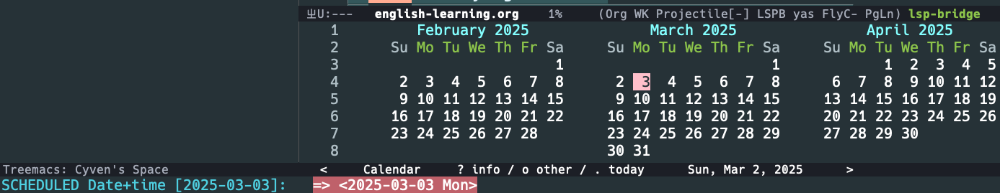

在 Emacs 中，org-mode中，当我用 `C-c C-s` 为一个 item 设置 schedule 的时候，

在 minibuffer 中会跳出让我输入 date+time，同时还有一个 calendar 的窗口 buffer，

但是我怎么选择这个 `calendar` 的光标，我 `C-f` 移动的是 minibuffer 输入框的 buffer，不是 calendar 的候选项，
好像只有 `<,>`,向前一个月，向后一个月起作用

其实上面的那个界面是 `org-read-date` 的界面,并不是 `calendar` 的界面, 这只是一个参考视图,并没有 `calendar` 的所有快捷键功能,它也不会自动获得焦点

但是可以通过

- `shift-<left>`, `shift-<right>` 向前/后移动一天
- `shift-<up>`,`shift-<down>` 向前/后移动一周
- `M-<left>`, `M-<right>` 向前/后一个月
- `M-<up>`, `M-<down>` 向前/后一年

当然,如果不需要 org-read-date 界面,通过

`(setq org-read-date-popup-calendar nil)` 来取消这个界面的跳出
