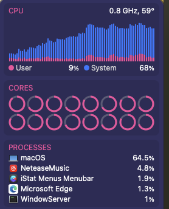

最近电脑不知道怎么的,就会很卡, 打开 Activity Monitor 可以看到一个 kernel_task 的进程 CPU 使用竟然高达 1000% 多!!!

通过 istat 也可以查看到电脑状态,16个核都基本跑满

这根本不正常,因为我电脑配置还可以,况且也没开什么程序

所以查了一下, 根据 [if kernel_task is using a large percentage of your Mac CPU](https://support.apple.com/en-us/102172) 这篇文章,
大概意思就是 `kernel_task` 是为了防止电脑过热启动的保护措施, 就好像汽车的引擎限速器,检测到引擎过热,防止爆炸,它就接管,你再踩油门也没用

注意,出现问题的不是 `kernel_task`, 而是有其他程序正在使得电脑变得过热

以下是我目前复盘的自检步骤,作为参考,前提是没有开启大型游戏,视频编辑等而莫名其妙的电脑卡顿问题

1. 壁纸是否是动态的,如果是弄成静态的
2. 是否有外接显示器,如果有,外界显示器和macbook的显示器显示描述文件选用的模式是否一致,保持一致
3. 如果外接显示器断开是否恢复正常,尤其是 16-inch 19 MacbookPro.以及电满后拔了充电口,是否恢复正常
4. 考虑[reset NVRAM ](https://support.apple.com/en-us/102539) 和 [reset the SMC](https://support.apple.com/en-us/102605)
5. 检查电脑的散热是否正常,清灰,换硅脂
