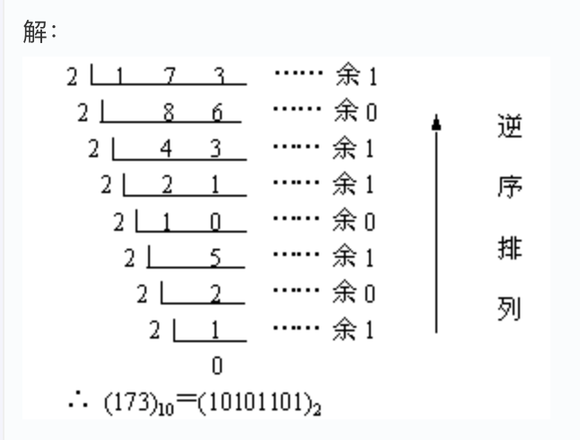
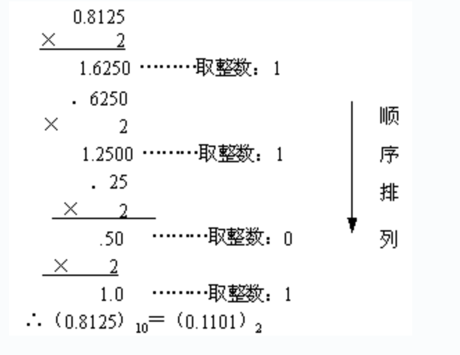

*IEEE(754)是一套表示小数的标准*

## 小数在计算机中使用浮点数表示

### 十进制小数如何转成二进制






### 为什么要使用浮点数表示
因为例如 `10.101` 计算机是看不懂的,尤其这个小数点,计算机不知道是什么意思

所以我们需要设计一套表达方式

浮点数是用符号,尾数,基数,指数来表示小数

例如112.54 可以是 +1.1254*10^2, 这里1.1254是尾数,基数是10,指数是2

同理,二进制的浮点数表示,也是类似的

只不过在计算机中,基数就是2,所以这部分可以忽略,就是符号,尾数,指数,三部分来表示

上面 10.101 可以使用 +1.0101e1来表示,e表示后面的是指数部分


## EXCESS系统

其实本质就是设置新的"坐标系","基准值"

### 定义与目的

属于一种偏置编码（Biased Representation）。
核心目的是将包括负数在内的指数范围转换成统一的正数形式，简化浮点数的存储和处理。

### 计算方法
步骤：

- 实际数值 \(N\) + Bias \(\rightarrow \) 转换为 \(n\) 位二进制。
- Bias确定：指数范围最大值的一半,小数点舍弃,指数部分8位, 1111 1111 是 255, 255/2向下取整127,Bias就是127

在 IEEE 754 标准的单精度浮点数中，指数部分使用 8 位，Bias为 127，称为 Excess-127。
举例： 若指数为 -1，使用 8 位 Excess-127 存储：\(-1+127=126\)（二进制：01111110）。


### 应用

IEEE754对于小数的指数部分使用 EXCESS系统表示


## 符号位

1/0

## 尾数:使用正则表达式

正则表达式是按照特定的规则来表示数据,除了小数之外,以及数据库也有各自的正则表达式

在IEEE754标准中,使用的正则表达式是,*将小数点前面的值固定位1*,也就是尾数部分需要写成 1.xxxx

例如
```
110110.01011101 ->
1.1011001011101 ->
尾数部分就是去掉 1. 的剩下的部分 1011001011101
```

再例如
```
0.001101 ->
1.101
尾数部分就是101
```
## 指数

首先因为尾数小数点移位,先要计算出幂值

`11.101` 其实就是 `2^1+2^0+2^(-1)+2^(-3)`

我们需要先转成
`1.1101` 其实就是 `2^0+2^(-1)+2^(-2)+2^(-4)`
用初中数学知识就知道

`11.101 = 1.1101 * 2^1`

有了幂值,我们再利用 EXCESS 系统来计算浮点数表达中的指数值

在32位单精度浮点数(float)中,基准是127,所以指数是 1+127 = 128, (1000 0000)
在64位双精度浮点数(double)中,基数是1023,所以指数是1+1023 = 1024, (100 0000 0000)

## 完整案例: 5.1


### 先转成二进制

5-> 101
0.1 -> 0.000110011001100....
```
0.1 * 2
0.2 0
0.4 0
0.8 0
1.6 1
1.2 1
0.4 0
0.8 0
1.6 1
1.2 1
...
```

101.000110011001100....

### 正则表达浮点

1.01000110011001100....e2

### 计算指数

127+2 = 129 (1000 0001)

### 写成浮点数float

0 1000 0001 0100 0110 0110 0110 0110 011


## c程序查看浮点数表示

```c
#include <stdio.h>
#include <string.h>

int main(){

  float num;
  unsigned long num_in_binary;

  char s[35];

  // get a decimal number;
  num = (float)5.1;

  // memory copy to num_in_binary;
  memcpy(&num_in_binary, &num, 4);

  // print very bits in num_in_binary;
  for(int i = 33; i>=0 ; i--){
    if(i == 1 || i == 10){
      s[i] = '-';
    }else{
      s[i] = (num_in_binary&1) == 0?'0':'1';
      num_in_binary>>=1;
    }
  }

  s[34] = '\0';

  printf("%s\n", s);


  return 0;
}

```
