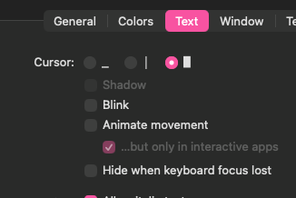

# problem
在使用 Ghostty 的时候,会发现通过 Ghostty 的配置`cursor-style = bar`来改变光标样式,它不生效

# how to fix

增加一个配置 ` shell-integration-features = no-cursor` ,就可以了

# why
官方文档中写到
> Note that shell integration will automatically set the cursor to a bar at a prompt, regardless of this configuration.

## 什么是 shell integration - by Gemini-3-pro

在以前，终端（比如系统自带的 Terminal.app）非常“笨”，它只负责两件事：

1. 把你敲的键盘按键发给 Shell (Fish/Zsh)。
2. 把 Shell 吐出来的文本画在屏幕上。

终端完全不知道哪一行是你敲的命令，哪一行是报错，哪一行是普通的文本输出。

现代终端（如 iTerm2、Ghostty、Kitty）引入了 Shell 集成技术。它利用一种叫 OSC 133（Operating System Command 133） 的不可见转义序列，在文本前后打标记。
Shell 会悄悄发送类似这样的暗号给终端：

- [OSC 133 A]：“嘿，Ghostty，我要开始画提示符（Prompt）了！”
- [OSC 133 B]：“画完了，现在等待用户敲键盘输入。”
- [OSC 133 C]：“用户敲回车了，我要开始执行命令了！”

## Ghostty的自作主张 - by Gemini-3-pro

既然 Ghostty 知道你什么时候在看提示符，什么时候在敲命令，它为了提供所谓的“最佳体验”，内置了一些联动特效（Features）：

智能标记：在命令行的左边显示红绿小圆点（成功或失败）。

点击跳转：双击命令输出，直接打开文件。

【光标控制】：当它收到 OSC 133 B（等待输入）时，它觉得“既然你要打字了，我就自动把光标变成一根竖线（|），这样最符合现代打字软件的习惯”。

这就是为什么无论你怎么配，Ghostty 都会在最后一刻把你的下划线重置成竖线的原因。

## shell-integration-features = no-cursor 的真正含义 - by Gemini-3-pro

shell-integration-features 是 Ghostty 提供的一个配置开关，允许你保留 Shell 集成带来的好处（比如智能目录追踪），但单独关闭某些你不喜欢的“特效”。

shell-integration-features：这是配置大类，意思是“我要调整 Shell 集成功能的行为”。

= no-cursor：这是具体的值。翻译成白话就是：“不要让 Shell 集成的状态去改变我的光标！”

当你写下这行配置时，Ghostty 内部的逻辑就变了：

收到 OSC 133 B（等待输入）。

Ghostty 检查配置：“哎呀，用户设置了 no-cursor”。

Ghostty 放弃重置光标的动作。

此时，你的终端就会安静地停留在你设置的基础配置 cursor-style = underline 上。


# process

因为一开始我在配置 starship, 我一直以为是 starship 的原因,而且starship刚好也是负责 prompt这块的渲染,
所以我引导 Gemini 的方向是错误的,而且回答也很合理因为指令覆盖

> 首先Ghostty启动,会加载配置,也就是读取了 `config.ghostty` 文件,这时候会正确的设置光标样式
> 但是,接下去 shell 启动 `load .zshrc if you using zsh, config.fish if fish`
> 如果使用 starship,在 starship init执行的时候,为了渲染复杂的图标和颜色，它会重置终端状态。
> ZLE/Fish 引擎启动：这是最关键的一步。Shell 准备接受输入时，会触发一个“输入初始化”动作。

到这里我都觉得很合理,当然这里引入了新的概念 ZLE

> ZLE 是 Zsh 处理输入的引擎。当你看到 Starship 漂亮的提示符出现时，ZLE 刚好启动。它默认会发送一个指令（通常是 \e[5 q 竖线）来告诉用户：“现在可以输入了”。这个动作发生在 .zshrc 加载之后。

> Fish 拥有一套原生的光标管理变量（如 fish_cursor_insert）。即使 Ghostty 设置了下划线，Fish 启动后发现这些变量有默认值（通常是 block 或 bar），它就会在渲染 Starship 提示符后，自动补发一个指令把光标改掉。

> Starship 本身不改光标，但它让 Shell 频繁地重新渲染提示符。每次渲染，Fish 都会检查一遍光标变量并发送指令。

如果终端使用iTerm2,则没有这个烦恼,因为 iTerm2 做了非标准拦截,你可以通过 iTerm2 设置



因此基于这个逻辑,我让AI给了我解决方案

*但其实这些解决方案都是脱裤子放屁,多此一举*

## zsh下,在 .zshrc 末尾

```
# 定义一个强制设置下划线的函数
function _force_underline() {
    printf '\e[4 q'
}
# 强制设置光标形状
# 1: 闪烁方块 | 2: 静止方块
# 3: 闪烁下划线 | 4: 静止下划线
# 5: 闪烁竖线 | 6: 静止竖线
# printf '\e[4 q'

# 挂载到 ZLE 的初始化钩子
function zle-line-init() {
    _force_underline
}
zle -N zle-line-init

# 挂载到 ZLE 的按键映射切换钩子（防止 Vi 模式干扰）
function zle-keymap-select() {
    _force_underline
}
zle -N zle-keymap-select

# 配合之前的 precmd 确保万无一失
autoload -Uz add-zsh-hook
add-zsh-hook precmd _force_underline
```


## fish

配置文件中加

```
fish_vi_cusor #它会在 Fish 的生命周期里偷偷挂载几个极高优先级的事件监听器
set -g fish_cursor_default underline
set -g fish_cursor_insert underline
set -g fish_cursor_replace_one underline
set -g fish_cursor_visual underline
```

这里我使用了 underline 样式


# lesson

到fish 这里,我突然意识到, `fish_vi_cursor`的性能问题
因为毫无疑问,它做了额外的事情,虽然可能在实际体验中,这个微不足道

但至此我开始寻找新的解决方案

直到我发现不是 starship 的锅, 但之前之所以误会,是因为那时候注释了 `starship init zsh`之后,光标的配置是可以的
但迁移到 fish 后,我没有重新做实验,我默认了还是 starship 的原因

最后其实解决方案很简单,就在[官方的文档里](https://ghostty.org/docs/config/reference#cursor-style)有提到

所以

1. 永远问自己,这是问题的根源吗?
2. 提问AI的方式,决定了它给出的解决方案,最终导致他用了绕路子的方法来解决问题,
3. 关注性能问题
