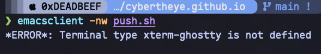

## problem



environment: Ghostty


## how to fix

### using Emacs.app as server by (server-start)
run

```shell
mkdir ~/.terminfo
( TERMINFO=/Applications/Ghostty.app/Contents/Resources/terminfo infocmp -x xterm-ghostty ) | ( TERMINFO=~/.terminfo tic -x - )
```

### when using `brew service`

modify `.plist`

see [solution](https://github.com/ghostty-org/ghostty/discussions/5902)
